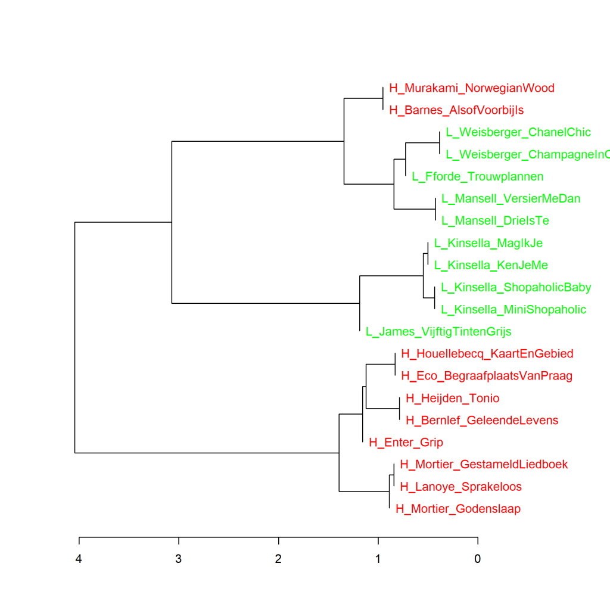
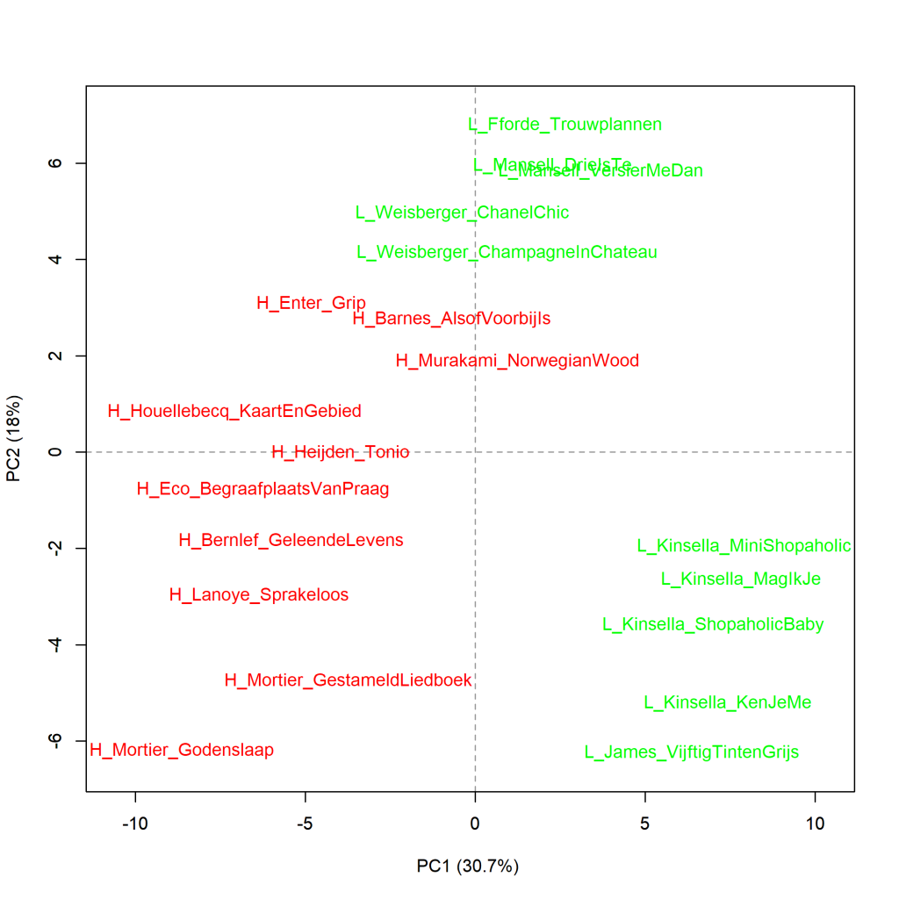
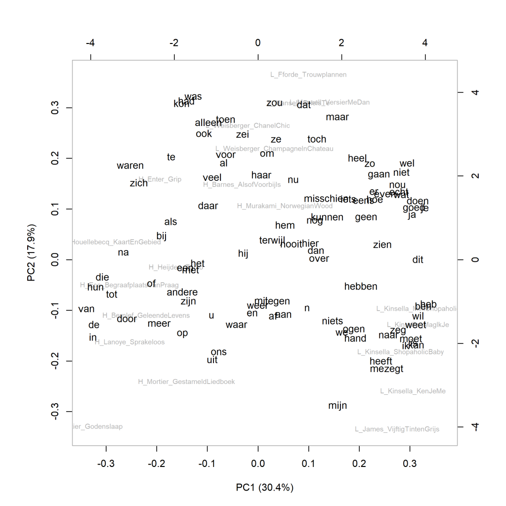
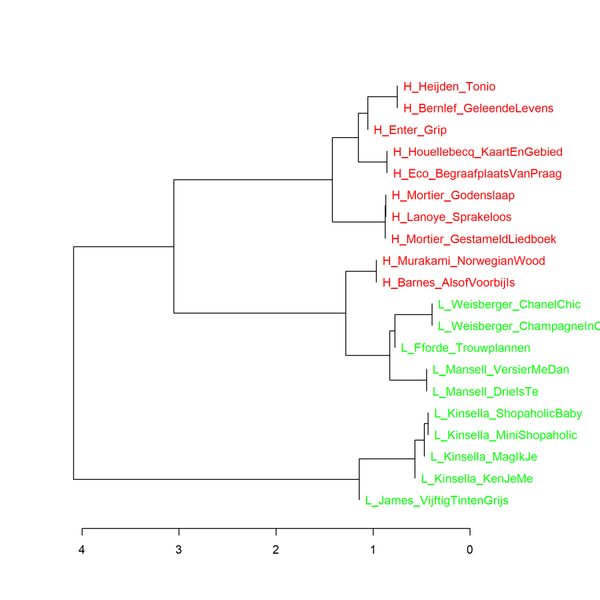
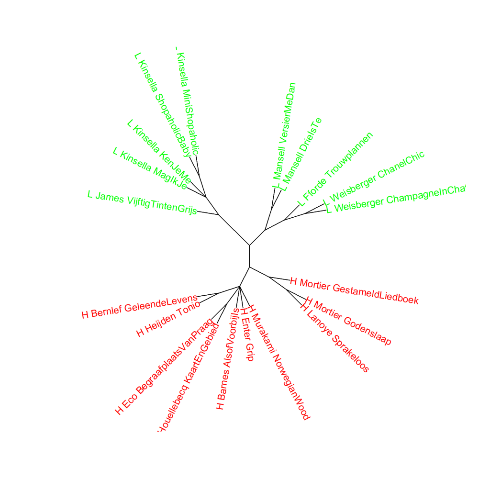
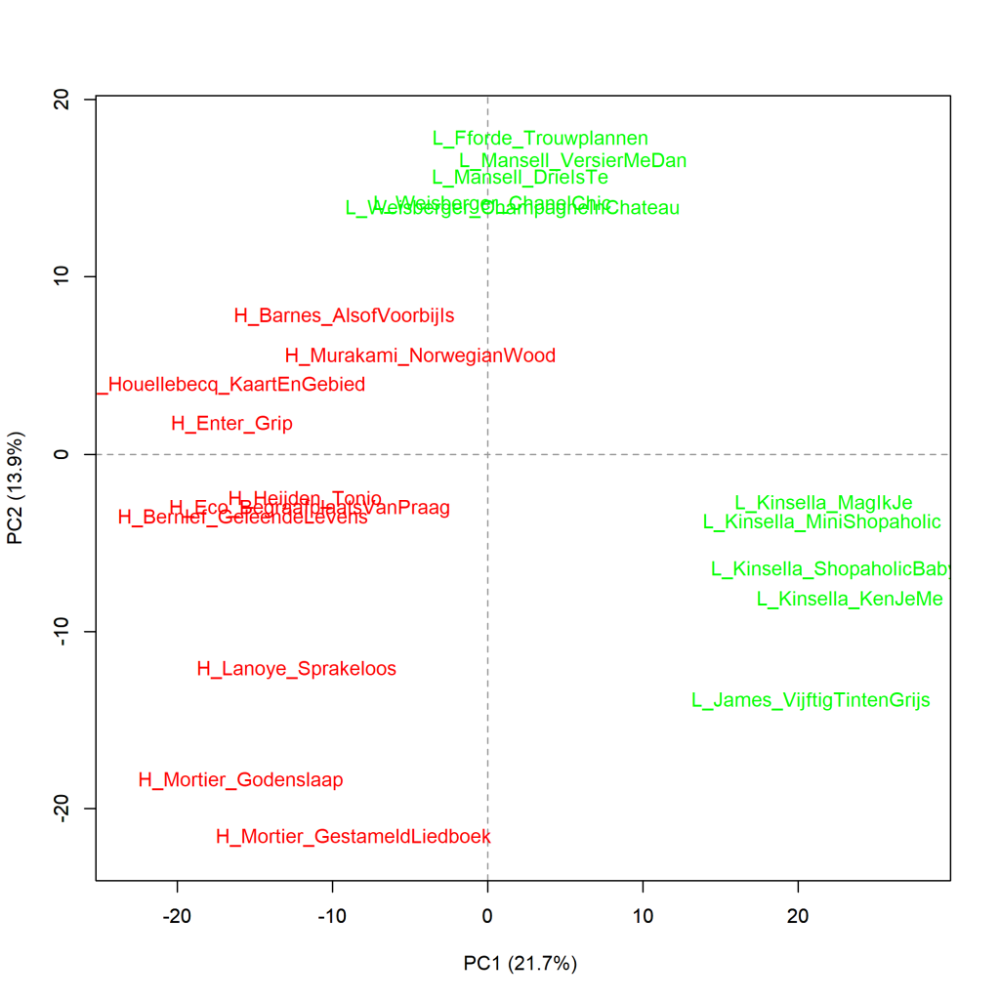

Colour version of the graph on p. 65 of *The Riddle of Literary Quality*.

The 10 novels with the highest (H) and lowest (L) scores for literary quality, cluster analysis (100 most frequent words).

Measure: Classic Delta (the Delta score is indicated below the horizontal axis).

Figure 3.1 shows that two books from the top 10, namely *Alsof het voorij is* (*The Sense of an Ending*) by Julian Barnes and *Norwegian wood* (*Norwegian Wood*) by Haruki Murakami are more similar in the use of the 100 most frequent words to the cluster of books by Weisberger, Fforde and Mansell that received very low scores for literary quality and to the cluster Kinsella and James, than to the 8 other novels that received the highest literary scores.

**Additional graphs: Top 10 most literary and least literary**
Like Figure 3.1 in the book, the additional charts below were created using the Stylo Package for R, developed by Maciej Eder, Mike Kestemont, Jan Rybicki, and Steffen Pielström. See https://github.com/computationalstylistics/stylo for more information about Stylo.

Below Figure 3.1.1 one may find moreinformation about principal components analysis (PCA). Below Figure 3.1.2, cluster analysis and the Delta score is explained in more detail, and Figure 3.1.2 has more on the bootstrap consensus tree.

**Figure 3.1.1: Top 10 most literary and least literary**

Principal components analysis (**100** most frequent words). Measure: PCA, correlation version.

The graph above shows a visualisation of a principal components analysis (PCA) for the 100 most frequent words. The proportions are in line with what the cluster analysis (Figure 3.1) already showed. In the graph below, the words that are strikingly more frequent in the different novels have been added to the graph (loadings). An example: In *Grip* by Stephan Enter, the word *zich* is used remarkably more often than in the other novels; in *Fifty Shades of Grey* by E.L. James, the greater proportion of *mijn* stands out.

More about this measure: This principal components analysis calculates correlations in the frequencies of words used in the selected novels. Based on those correlations, how the book compares to the other novels in the selection is calculated for each novel. The first component reflects the cluster of correlated variables that together explain most of the variation in the data. The second principal component reflects the largest amount of correlating variables from the remaining variables (i.e. those that do not correlate with the first component). In the visualisation of a principal components analysis, we can see how the texts relate to each other on the first (pictured horizontally) and second (pictured vertically) components. The closer books are to each other, the more similar they are in the frequency pattern of the chosen number of most frequent words. References to more information about PCA can be found on pp. 69-70 of *The Riddle of Literary Quality*.

**Figure 3.1.2: Top 10 most literary and least literar**

Cluster analysis (**130** m0st frequent words). Measure: Classic Delta.

In measures with 130 most frequent words (MFW) and higher, the 10 novels rated most literary are always found together in the same cluster. The novels rated with low scores for literary quality, by Weisberger, Fforde and Mansell, are just slightly more similar to the 10 most literary novels than to the other 5 novels, by Kinsella and James. At 110 and 120 MFW, we see the same picture as in Figure 3.1.2.

More on cluster analysis: In a cluster analysis, based on statistical grounds, the most similar texts based on words and word frequencies are always linked two by two, then the clusters that are most similar are also linked two by two, and so on. The visualisation of the measurement shows this as follows: The further to the right in the graph two books or clusters of books are connected by a vertical line, the more similar they are in the frequency of words analysed. See *The Riddle of Literary Quality* p. 114 for more information.

More on Classic Delta: The 'Delta' is a number that indicates the degree of difference in word usage and word frequencies between texts that are part of a large corpus of texts. For each text in that corpus, the different words in it and how often each word occurs are identified. It then looks at how the use of each word in that text compares with the average use of that word in the whole text set. For all selected words (e.g. the 100 most frequent or the 1,000 most freuent words), the deviations of usage from the mean are added up: the 'Delta' score. See *The Riddle of Literature* p. 24-25 for more information on the Delta score.

Meer over Classic Delta: De ‘Delta’ is een getal dat aanduidt wat de mate van verschil in woordgebruik en woordfrequenties is tussen teksten die deel uitmaken van een groot corpus van teksten. Voor elke tekst in dat corpus wordt vastgesteld welke verschillende woorden erin voorkomen en hoe vaak elk woord voorkomt. Vervolgens wordt gekeken hoe het gebruik van elk woord in die tekst zich verhoudt tot het gemiddelde gebruik van dat woord in de hele tekstverzameling. Voor alle geselecteerde woorden (bijvoorbeeld de 100 meest frequente of de 1000 meest freuente woorden) worden de afwijkingen van het gebruik ten opzichte van het gemiddelde opgeteld: de ‘Delta’-score. Zie *Het raadsel literatuur* p. 24-25 voor meer informatie over de Delta-score.

**Grafiek 4.5.3 Top 10 meest literair en minst literair**

Bootstrap consensus tree (**100** - **1000** meest frequente woorden, increment van 100, consensus strength 0.5). Maat: Classic Delta.

Zoals hierboven al bleek, is de uitkomst van clusteranalyses gemaakt op basis van verschillende aantallen meest frequente woorden (MFW) niet altijd dezelfde. Het is nuttig om een hele reeks aan verschillende clusteranalyses te doen en daar dan een soort gemiddelde van te berekenen. Dat kan worden gedaan door in Stylo te kiezen voor een bootstrap consensus tree. In de grafiek hieronder is het resultaat gevisualiseerd van het gemiddelde van clusteranalyses gemaakt op basis van de 100 MFW tot en met de 1000 MFW met een increment van 100; dat betekent dat er in totaal tien clusteranalyses zijn gemaakt (100, 200, 300, ...., 900 en 1000 MFW). De gekozen consensus strength is 0,5, wat betekent dat twee romans of clusters aan elkaar geclusterd worden als ze in minimaal de helft van de metingen het meest op elkaar lijken. In Grafiek 4.5.3 is te zien dat de bootstrap consensus analyse in dit geval alle meest literair gevonden boeken bijelkaar clustert tegenover alle romans die het minst literair beschouwd werden.

**Grafiek 4.5.4 Top 10 meest literair en minst literair**

Analyse op hoofdcomponenten (**1000** meest frequente woorden). Maat: PCA, correlatieversie.

In de visualisatie van deze meting zien we dat de 10 meest literair gevonden boeken (H, in rood) samenscholen aan de linkerkant van de grafiek, dat zij het meest verschillen van de minst literair gevonden boeken van James en Kinsella (L, in groen), die rechts in de grafiek opduiken, en dat de ook weinig literair gewaardeerde romans van Fforde, Mansell en Weisberger dichter bij de meest literaire romans staan. Het is hetzelfde beeld als in grafiek 4.5.1, maar de afstanden zijn groter geworden nu we naar de 1000 in plaats van naar de 100 meest frequente woorden hebben gekeken.

**Conclusie**

De conclusie die uit al deze metingen te trekken is (meer hierover in *Het raadsel literatuur* op p. 73 en verder), is dat de meest literair gevonden romans een ander woordfrequentiepatroon hebben dan de minst literaire boeken. Dat heeft echter naar alle waarschijnlijkheid eerder te maken met een genreverschil en genreconventies op het niveau van het woordgebruik dan met een verschil in toegekende literaire kwaliteit.

<!-- **Hoe zijn de metingen te repliceren?**
VOORBEELDQUERY HIER! -->
