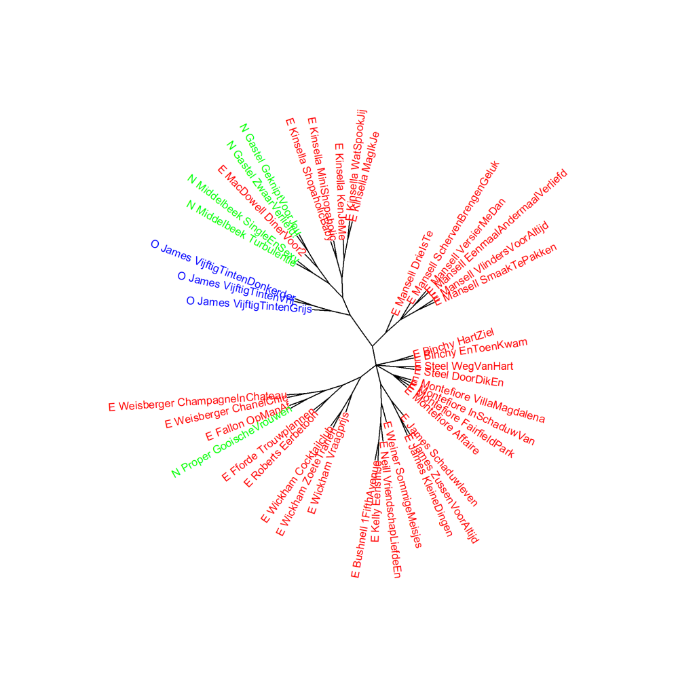

Colour version of the graph on p. 71 of *The Riddle of Literary Quality*.

E.L. James, Vijftig tinten-trilogie (Fifty Shades Trilogy) and Romance, principal components analysis (1000 most frequent words).
Novels translated from English are shown with an E_ before the author and abbreviated title, and originally
Dutch-language novels are indicated by N_. The O_ for the *Fifty Shades* trilogy stands for Other. Measre: PCA, correlation version.

### **Additional graphs <i>Fifty Shades</i> and Romance**

These graphs have also been created using the Stylo Package for R. See Figure 3.1 for more information about the package and the measures.

**Figure 3.3.1:<i>Fifty Shades</i> and Romance**

Cluster analysis (**1000** most frequent words). Measure: Classic Delta.

The visualisation of this cluster analysis also clearly shows that books by the same author are usually the most similar to each other. The distance of the *Fifty Shades* trilogy from the rest is less in this measurement than it appears in the analysis on principal components as visualised in Figure 3.3: the trilogy is slightly more than two Delta scores away from the novels by Van Gastel, Macdowell, Middelbeek and Kinsella.That picture does not change when we do a whole series of cluster analyses as visualised in the bootstrap consensus tree in Figure 3.3.2.

**Figure 3.3.2:<i>Fifty Shades</i> and Romance**

Bootstrap consensus tree (**100** - **1000** most frequent words, increment 100, consensus strength 0.5). Measure: Classic Delta.

**Conclusion**

The additional measurements nuance the picture that the *Fifty Shades* trilogy does not overlap in terms of word frequencies with the books from the Romance category in the survey corpus.
