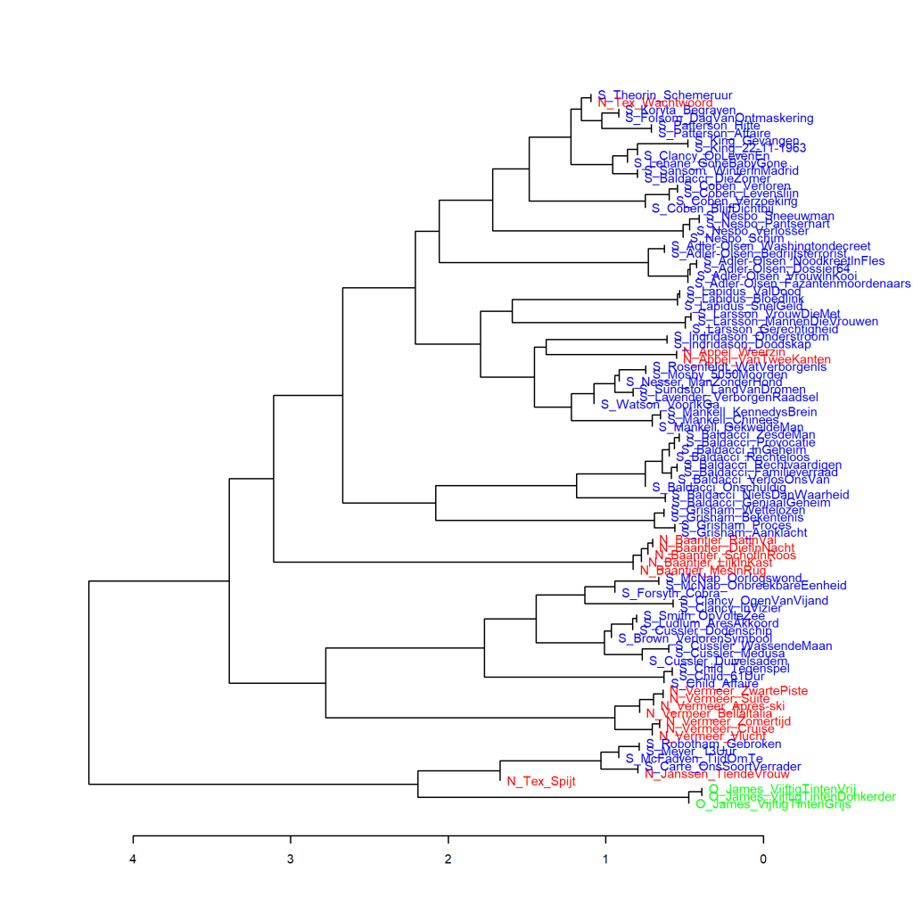

Additional graphs for p. 72 of *The Riddle of Literary Quality*.

These graphs have also been created using the Stylo Package for R. See Figure 3.1 for more information about the package and the measures.

In *The Riddle of Literary Quality* two graphs feature the *Fifty Shades*-trilogy by E.L. James, comparing them with other novels to find out to which genre they are closest in their word frequencies. Figure 3.3 compares them to Romance and Figure 3.4 to Suspense written by female authors. Figure 3.4 only included novels by female authors because otherwise the graph would be too cluttered. Here, some additional graphs are presented in which the trilogy is compared with Suspense novels written by male authors. The comparison with Literary novels can be found in the next item on this website.

**Figure 3.4.3: <i>Fifty Shades</i> Trilogy and Suspense written by male authors**

Novels translated from English are shown with an E_ for the author and abbreviated title, and originally Dutch-language novels are marked N_. The O_ for the Fifty Shades trilogy stands for Other. Measure: PCA, correlation version.

**Figure 3.4.4: <i>Fifty Shades</i> Trilogy and Suspense written by male authors**

Cluster analysis (**1000** most frequent words). Measure: Classic Delta.

**Figure 3.4.5: <i>Fifty Shades</i> Trilogy and Suspense written by male authors**

Bootstrap consensus tree (**100** - **1000** most frequent words, increment 100, consensus strength 0.5). Measure: Classic Delta.

**Conclusion**

The *Fifty Shades* trilogy is further removed from the Suspense novels written by male authors than from those written by female authors (see, for example, the Delta score in Figure 3.4.4 below the graph at the level where the trilogy clusters with about six Suspense novels). Furthermore, it is striking in these additional graphs that Dutch and translated Suspense novels appear well mixed, whereas in the analyses of women's Suspense novels in Figure 3.4, there seems to be a much larger difference between Dutch and translated titles. More on this in *The Riddle of Literary Quality* on pp. 72-73.

