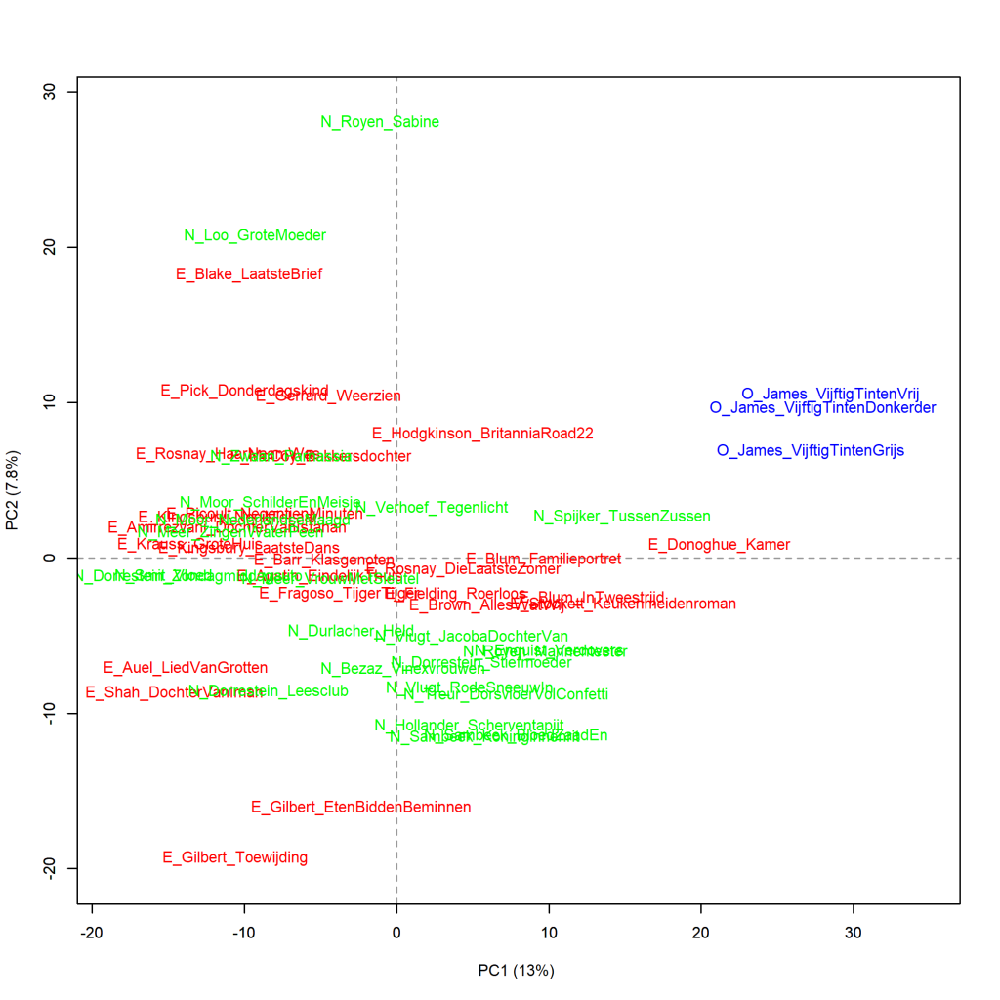
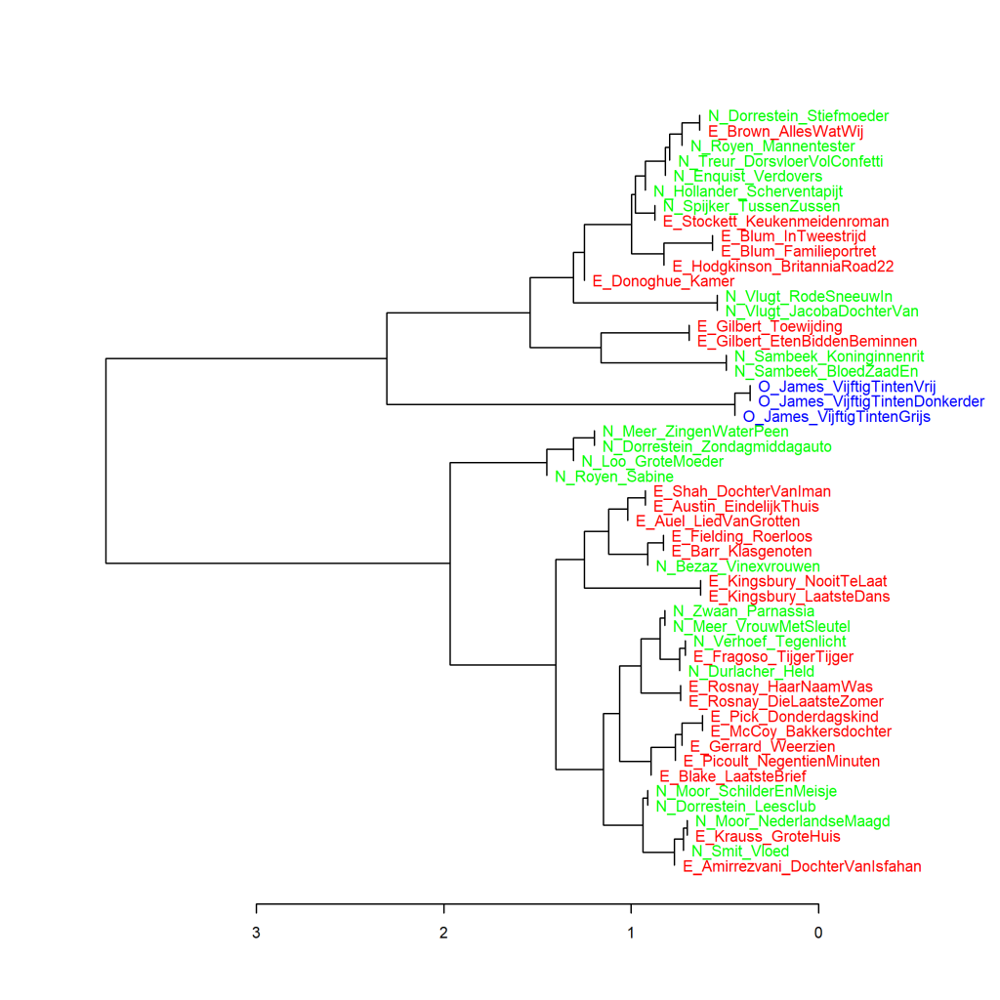
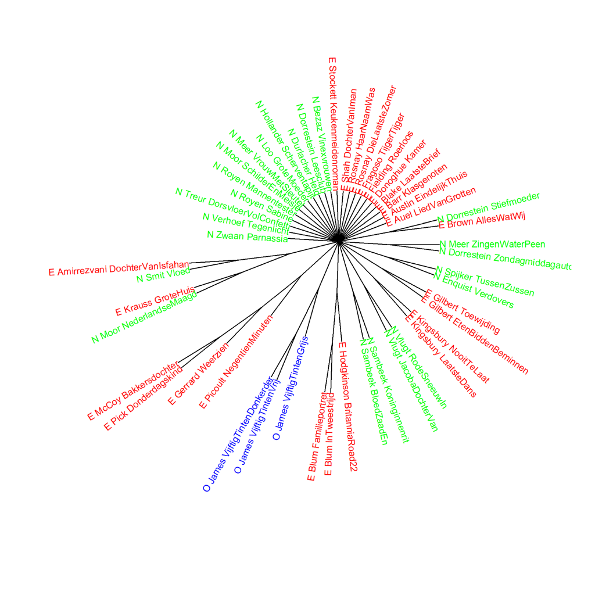
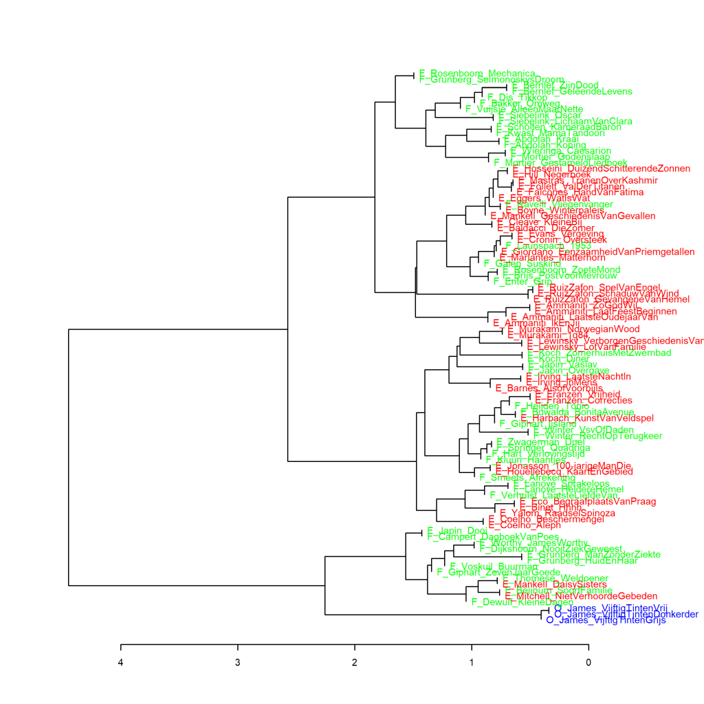
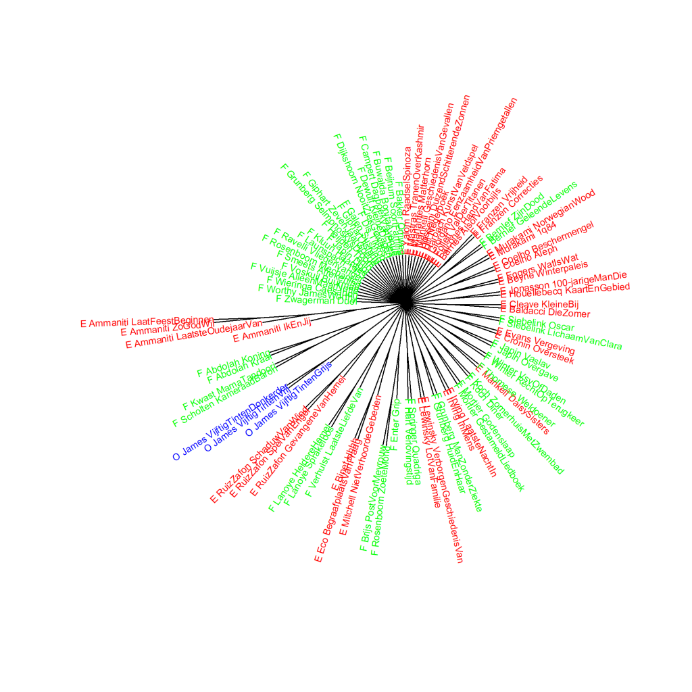

Extra grafieken bij p. 245-247 van *Het raadsel literatuur*.

Ook deze grafieken zijn gemaakt met het Stylo Package for R. Zie  Grafiek 4.5 voor meer informatie over het package en de verschillende maten.

In *Het raadsel literatuur* zijn twee grafieken afgedrukt waarin de *Vijftig tinten*-trilogie van E.L. James wordt vergeleken met andere romans om uit te vinden op welk genre de boeken het meeste lijken in woordfrequenties; in Grafiek 9.2 met Romantiek en in Grafiek 9.3 met Spanning van de hand van vrouwelijke auteurs. Hier presenteer ik de vergelijking met de Literaire romans uit het onderzoekscorpus. In de vorige webpagina staan de grafieken waarin de trilogie wordt vergeleken met Spanning geschreven door mannelijke auteurs; in Grafiek 9.3 in *Het raadsel literatuur* zijn alleen de spannende boeken van vrouwen opgenomen omdat de visualisatie niet meer leesbaar zou zijn als de boeken van vrouwen en mannen tegelijk onderzocht zouden worden. Voor de vergelijkingvan de trilogie met Literaire romans splits ik de boeken op dezelfde manier op; eerst kijken we of de *Vijftig tinten*-trilogie aansluit bij de Literaire romans geschreven door vrouwen (analyse op hoofdcomponenten, clusteranalyse, en tot slot een bootstrap consensus tree) en daarna bij de Literaire romans van de hand van mannelijke auteurs. Het zal duidelijk worden dat de trilogie het minst ver af staat van de spannende boeken van vrouwen in het onderzoekscorpus - maar alleen in een analyse op hoofdcomponenten; in de clusteranalyses lijkt er weinig verschil te zijn in de afstanden tot de andere boeken.

**Grafiek 9.3.6 Vijftig tinten en Literaire romans geschreven door vrouwen**

Uit het Engels vertaalde romans staan weergegeven met een E_ voor de auteur en verkorte titel, en oorspronkelijk Nederlandstalige romans zijn aangeduid met N_. De O_ voor de Vijftig tinten-trilogie staat voor Overig. Maat: PCA, correlatieversie.

**Grafiek 9.3.7 Vijftig tinten en Literaire romans geschreven door vrouwen**

Clusteranalyse (**1000** meest frequente woorden). Maat: Classic Delta.

**Grafiek 9.3.8 Vijftig tinten en Literaire romans geschreven door vrouwen**

Bootstrap consensus tree (**100** - **1000** meest frequente woorden, increment van 100, consensus strength 0.5). Maat: Classic Delta.

**Grafiek 9.3.9 Vijftig tinten en Literaire romans geschreven door mannen**

Uit het Engels vertaalde romans staan weergegeven met een E_ voor de auteur en verkorte titel, en oorspronkelijk Nederlandstalige romans zijn aangeduid met N_. De O_ voor de Vijftig tinten-trilogie staat voor Overig. Maat: PCA, correlatieversie.

**Grafiek 9.3.10 Vijftig tinten en Literaire romans geschreven door mannen**

Clusteranalyse (**1000** meest frequente woorden). Maat: Classic Delta.

**Grafiek 9.3.11 Vijftig tinten en Literaire romans geschreven door mannen**

Bootstrap consensus tree (**100** - **1000** meest frequente woorden, increment van 100, consensus strength 0.5). Maat: Classic Delta.

**Conclusie**

De *Vijftig tinten*-trilogie staat op enige afstand van het genre van de Literaire roman. Uit alle metingen (Grafiek 9.2, 9.3 en de extra grafieken) blijkt dat de trilogie het minst ver af staat van de spannende boeken van vrouwen in het onderzoekscorpus, maar daar moet bij worden vermeld dat dat alleen duidelijk wordt in een analyse op hoofdcomponenten. In de clusteranalyses lijkt er weinig verschil te zijn in de afstanden tot de andere boeken. Meer hierover in *Het raadsel literatuur* op p. 245-247.

<!-- **Hoe zijn de metingen te repliceren?**
VOORBEELDQUERY HIER! -->
