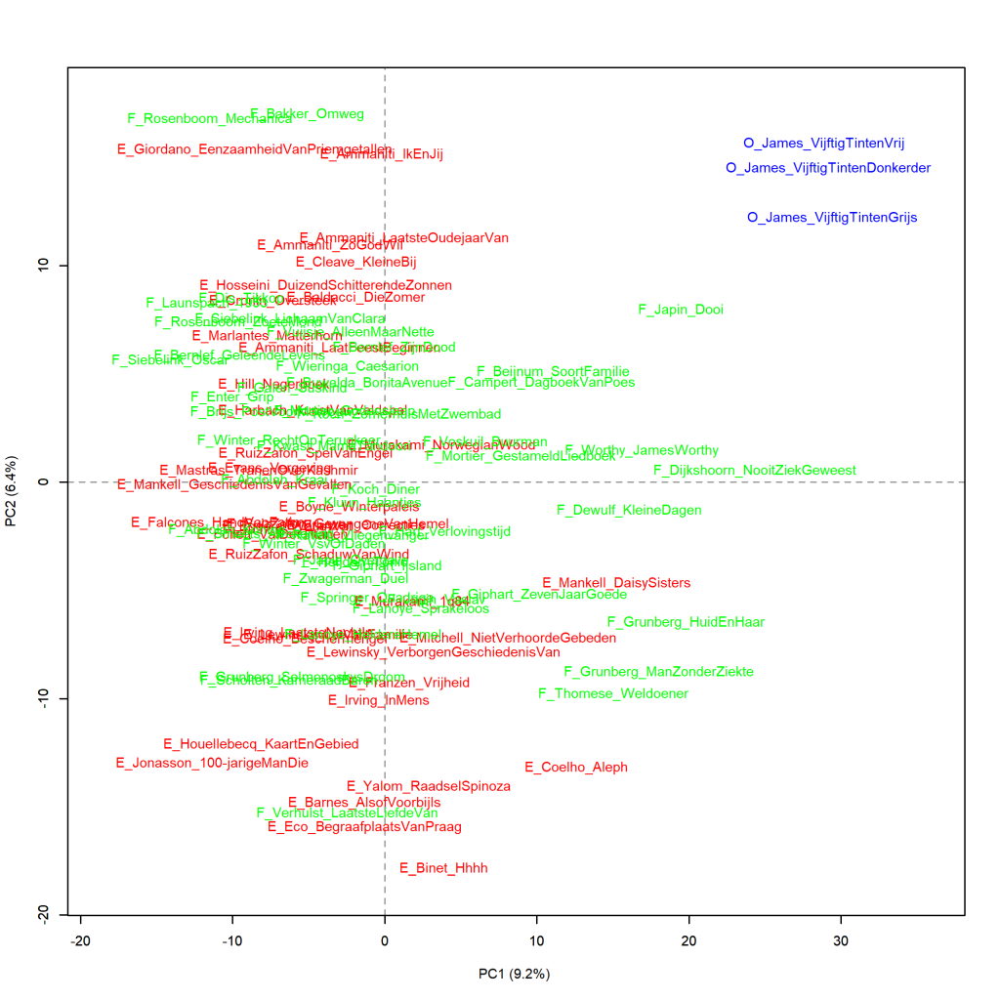

Additional graphs for p. 72 of *The Riddle of Literary Quality*.

These graphs have also been created using the Stylo Package for R. See Figure 3.1 for more information about the package and the measures.

In *The Riddle of Literary Quality* two graphs feature the *Fifty Shades*-trilogy by E.L. James, comparing them with other novels to find out to which genre they are closest in their word frequencies. Figure 3.3 compares them to Romance and Figure 3.4 to Suspense written by female authors. Here I present the comparison with Literary novels from the research corpus. In the previous webpage, the graphs comparing the trilogy with Suspense written by male authors are shown; in Figure 3.4 in *The Riddle of Literary Quality*, only women's Suspense novels are included because the visualisation would no longer be readable if women's and men's books were examined at the same time. For the comparison of the trilogy with Literary novels, I split the books in the same way; first, we look at whether the *Fifty Shades* trilogy fits with Literary novels written by women (principal components analysis, cluster analysis, and finally a bootstrap consensus tree) and then with Literary novels written by male authors. It will become clear that the trilogy is the least distant from the Suspense novels by female authors in the research corpus - but only in a PCA; in the cluster analyses, there seems to be little difference in the distances to the other books.

**Figure 3.4.6: *Fifty Shades* and Literary novels written by women**

Novels translated from English are shown with an E_ before the author and abbreviated title, and originally Dutch-language novels are indicated by N_. The O_ for the *Fifty Shades* trilogy stands for Other. Measure: PCA, correlation version.

**Figure 3.4.7: *Fifty Shades* and Literary novels written by women**

Cluster analysis (**1000** most frequent words). Measure: Classic Delta.

**Figure 3.4.8: *Fifty Shades* and Literary novels written by women**

Bootstrap consensus tree (**100** - **1000** most frequent words, increment 100, consensus strength 0.5). Measure: Classic Delta.

**Figure 3.4.9: *Fifty Shades* and Literary novels written by men**

Novels translated from English are shown with an E_ before the author and abbreviated title, and originally Dutch-language novels are indicated by N_. The O_ for the *Fifty Shades* trilogy stands for Other. Measure: PCA, correlation version.

**Figure 3.4.10: *Fifty Shades* and Literary novels written by men**

Cluster analysis (**1000** most frequent words). Measure: Classic Delta.

**Figure 3.4.11: *Fifty Shades* and Literary novels written by men**

Bootstrap consensus tree (**100** - **1000** most frequent words, increment 100, consensus strength 0.5). Measure: Classic Delta.

**Conclusion**

The *Fifty Shades* trilogy is at some distance from the category of the Literary novel. All measurements (Figures 3.3, 3.4 and the additional graphs) show that the trilogy is the least distant from Suspense novels written by female authors, but it should be noted that this only becomes clear in a principal components analysis. In the cluster analyses, there seems to be little difference in the distances to the other books. More on this in *The Riddle of Literary Quality* on pp. 71-73.