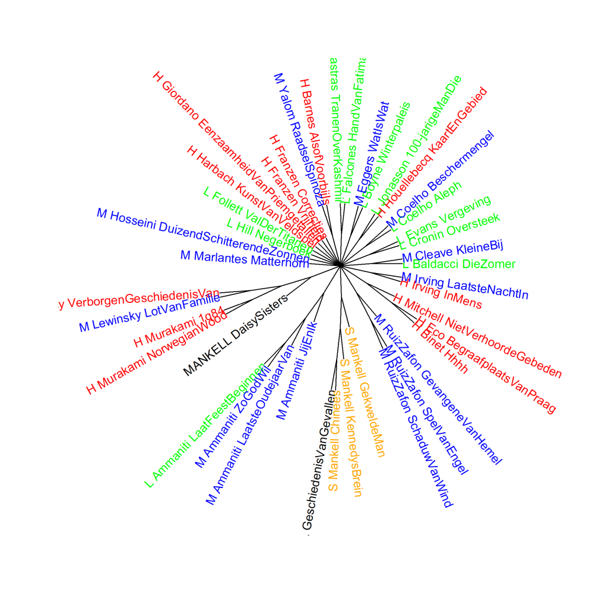

Colour version of the graph on p. 79 of *The Riddle of Literary Quality*.

Translated literary novels by male authors and three Suspense novels by Mankell, principal components analysis (1000 most frequent words). S_: the three Suspense novels by Henning Mankell. His two Literary novels are marked by the author's name in capital letters.
Scores for literary quality: H_ (high), L_ (low), and M_ (medium). Measure: PCA, correlation version.

### **Additional graphs: Translated Literary novels written by male authors and three Suspense novels by Mankell**

These graphs have also been created using the Stylo Package for R. See Figure 3.1 for more information about the package and the measures.

Figure 3.5.1 presents a cluster analysis and Figure 3.5.2 a bootstrap consensus tree of the same translated novels by male authors as in Figure 3.5. Compared to Figure 5.2 in Chapter 5 of *The Riddle of Literary Quality*, p. 130 in the monograph, novels that also appear in Figure 3.5 are often in a different place in the visualisation. This is because three novels have now been added and the measurement always analyses how the novels relate to each other. With additions or changes, the composition of the corpus as a whole changes and so do the relationships between them. This is visible in the graphs.

**Figure 3.5.1: Translated Literary novels written by male authors and three Suspense novels by Mankell**

Cluster analysis (**1000** most frequent words). Measure: Classic Delta.

The visualisation of this cluster analysis also clearly shows that books by the same author are usually most similar to each other. Four of Mankell's five novels cluster together - three from the Suspense category and one of his two Literary novels. The fifth, Literary novel is slightly further away, but still in the same main branch.

**Figure 3.5.2: Translated Literary novels written by male authors and three Suspense novels by Mankell**

Bootstrap consensus tree (**100** - **1000** most frequent words, increment 100, consensus strength 0.5). Measure: Classic Delta.

Even if we do a whole series of cluster analyses, the pattern remains the same. Mankell's diverging Literary novel clusters with the two literary novels in the corpus by Haruki Murakami and by Charles Lewinsky. Mankell's other Literary novel clusters with Mankell's three Suspense books.

**Conclusion**

That the novel *De Daisy Sisters* differs from Mankell's other four novels may have to do with a big difference in time of origin: the novel was only recently translated (in 2009), but the original Swedish text was published as early as 1982. It seems we can also see in the translation that Mankell's own writing style has changed over the years. By the way, it is striking that in Figure 5.2 in Chapter 5 of *The Riddle of Literary Quality*, p. 130 in the monograph, *De Daisy Sisters* comes closest to *Norwegian Wood* by Haruki Murakami, for which something similar applies: the original version appeared much earlier, in 1987. On this, see *The Riddle of Literary Quality* p. 129.

More on Henning Mankell's five novels in *The Riddle of Literary Quality* on pp. 77-79. Special attention to Jonas Jonasson's *The hundred-year-old man who climbed out the window and disappeared*, which nestled among the Mankells in Figure 3.5, on p. 79-80 of *The Riddle of Literary Quality*.
