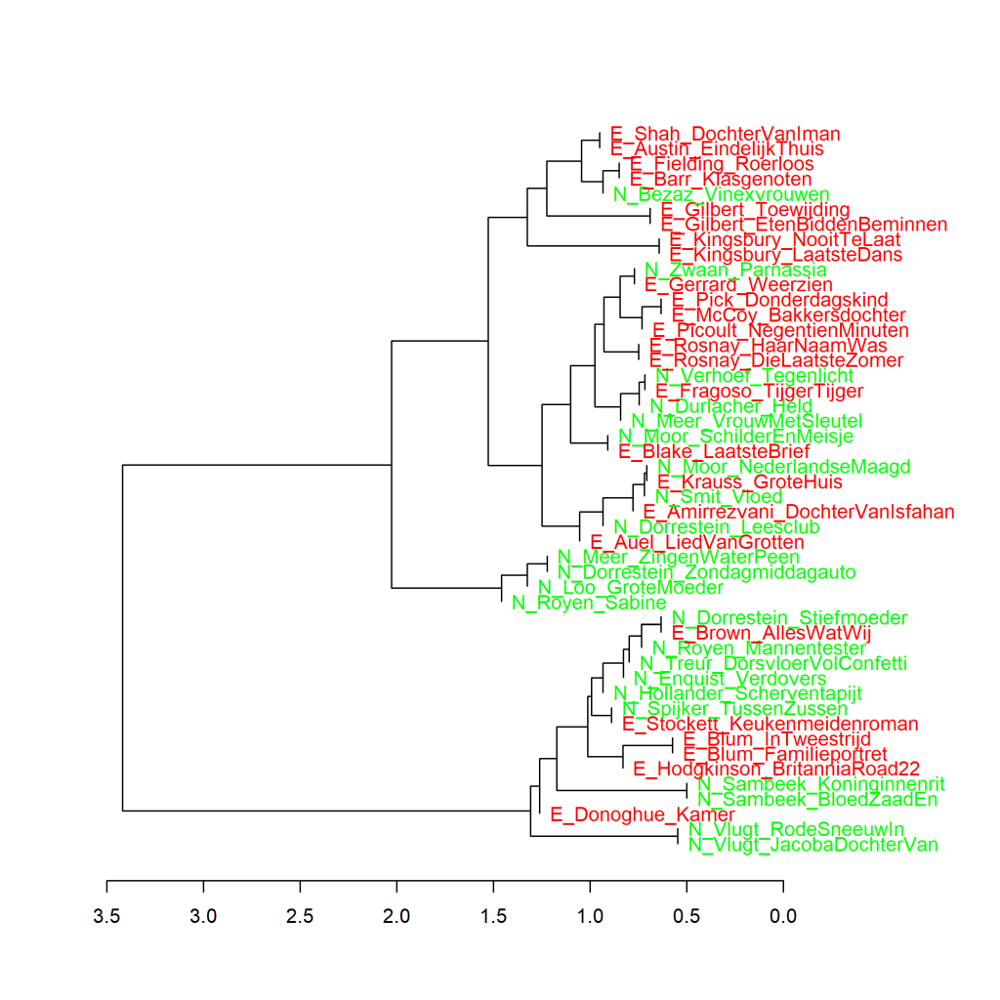

Colour version of the graph on p. 87 of *The Riddle of Literary Quality*.

Dutch Literary novels (N_) and Literary novels translated from English (E_) by female authors, principal components analysis (1000 most frequent words). Measure: PCA, correlation version.

### **Additional graphs: Dutch Literary novels and Literary novels translated from English by female authors**
All graphs have been created using the Stylo Package for R. See Figure 3.1 for more information about the package and the measures.

Figure 3.6 shows that Dutch Literary novels (N_) and literary novels translated from English (E_) by female authors do not appear as two different clusters in the visualisation in the frequency use of the 1000 most frequently used words. A cluster analysis (Figure 3.6.1 below) and a bootstrap consensus tree (Figure 3.6.2 below) based on 1000 most frequent words also present the same picture.

**Figure 3.6.1: Dutch Literary novels and Literary novels translated from English by female authors**

Cluster analysis (**1000** most frequent words). Measure: Classic Delta.

In the visualisation of this cluster analysis, it is again very clear to see that books by the same author usually cluster closest together, again highlighting the success of authorship recognition of this method. Exceptions to that pattern are particularly interesting.

The cluster of four books furthest away from the other titles in Figure 3.6.1 (which cluster furthest to the left in the visualisation) are, by the way, all four short stories. The considerably smaller size of the four publications is probably the reason for their outlier position. 

**Figure 3.6.2: Dutch Literary novels and Literary novels translated from English by female authors**

Bootstrap consensus tree (**100** - **1000** most frequent words, increment 100, consensus strength 0.5). Measure: Classic Delta.

In Figure 6.1.2, there are a lot of Dutch Literary novels and Literary novels translated from English at the top directly connected to the centre of the graph. This means that for all these novels, the software could not identify which other novel they most resembled. So the place they occupy in the visualisation says nothing about the relationships between them.

**Conclusion**

In the frequencies of the 1000 most frequently used words, no clear difference can be found between the selected Literary novels originally written in Dutch and Literary novels translated from English by female authors.