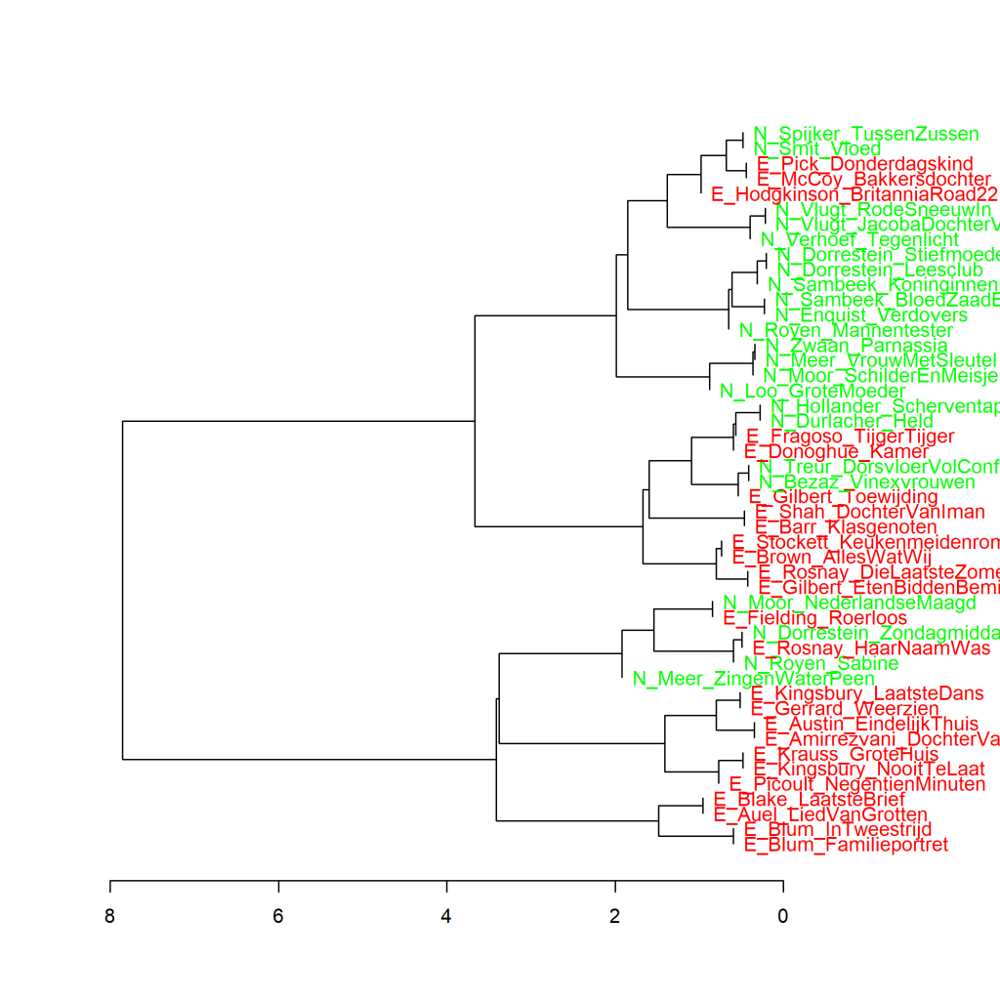

Colour version of the graph on p. 88 of *The Riddle of Literary Quality*.

The conjunctions *en* (and), *toen* (then), *dat* (that), *voordat* (before), *terwijl* (while), and *hoewel* (although) in Literary novels by female authors written in Dutch and translated from English. Measure: PCA, correlation version.

### **Additional graph: Conjunctions in Literary novels by female authors written in Dutch and translated from English**
These graphs have also been created using the Stylo Package for R. See Figure 3.1 for more information about the package and the measures.

**Figure 3.7.1: Conjunctions in Literary novels by female authors written in Dutch and translated from English**

The conjunctions *en* (and), *toen* (then), *dat* (that), *voordat* (before), *terwijl* (while), and *hoewel* (although) in Literary novels by female authors written in Dutch (N_) and translated from English (E_). Measure: Clusteranalyse (6 words). Measure: Classic Delta.

Figure 3.7.1 shows the same rough dichotomy as in the visualisation of the analysis by main components in Figure 3.7. What is striking here is that the two novels by Renate Dorrestein that ended up in different clusters in Figure 3.6 do look most similar here. So the difference between those two novels does not lie in a different handling of these six conjunctions.

**Conclusion**

In the selected novels, there is a fairly visible difference in the frequency of the six conjunctions in originally Dutch Literary novels by female authors and literary novels translated from English. It seems, therefore, that translators, under the influence of the source language (English), adopt a different frequency pattern in their use of these conjunctions in their target text (the translation into Dutch) than authors who wrote their novels directly into Dutch. This is probably an unconscious process, but readers may, just as unconsciously, still notice this when reading and therefore know they are dealing with a translation. And that unconscious feeling may in turn influence the score they give a book for literary quality.
