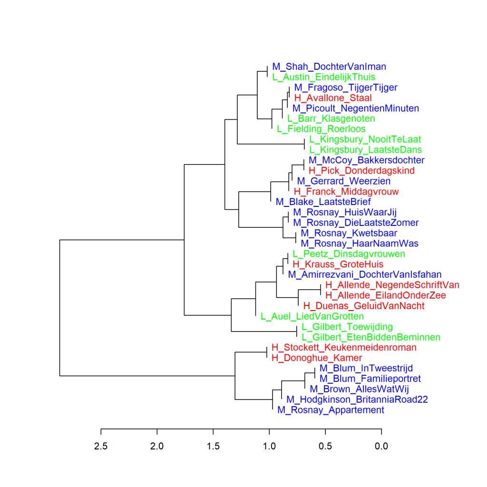
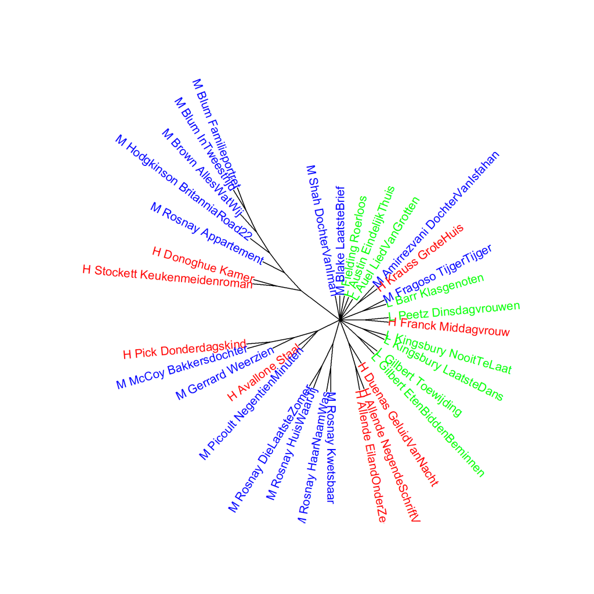

Colour version of the graph on p. 102 of *The Riddle of Literary Quality*.

Translated Literary novels written by female authors, princpal components analysis (1000 most frequent words)
Scores for literary quality: H_ (high), L_ (low), and M_ (middle group). Measure: PCA, correlation version.

### **Additional graphs: Translated Literary novels written by female authors**
These graphs have also been created using the Stylo Package for R. See Figure 3.1 for more information about the package and the measures.

Figure 7.3.1 presents a cluster analysis (Figure 4.3.1 below) and Figure 4.3.2 a bootstrap consensus tree of the same three groups of translated literary novels by female authors as in Figure 4.3.

**Figure 4.3.1: Translated Literary novels written by female authors**

Cluster analysis (**1000** most frequent words). Measure: Classic Delta.

The visualisation of this cluster analysis also clearly shows that books by the same author tend to be most similar to each other. Furthermore, there are no separate branches for novels that received the highest or lowest scores for literary quality or belonged to the middle group.

**Figure 4.3.2: Translated Literary novels written by female authors**

Bootstrap consensus tree (**100** - **1000** most frequent words, increment 100, consensus strength 0.5). Measure: Classic Delta.

If we do a whole series of cluster analyses, the pattern remains the same.

**Conclusion**

For the translated Literary novels by female authors, we see no clear difference in the frequencies of the 1000 most frequently used words between the novels that received the highest or lowest scores for literary quality or belonged to the middle group. More on this in *The Riddle of Literary Quality* on p. 102 onwards.
