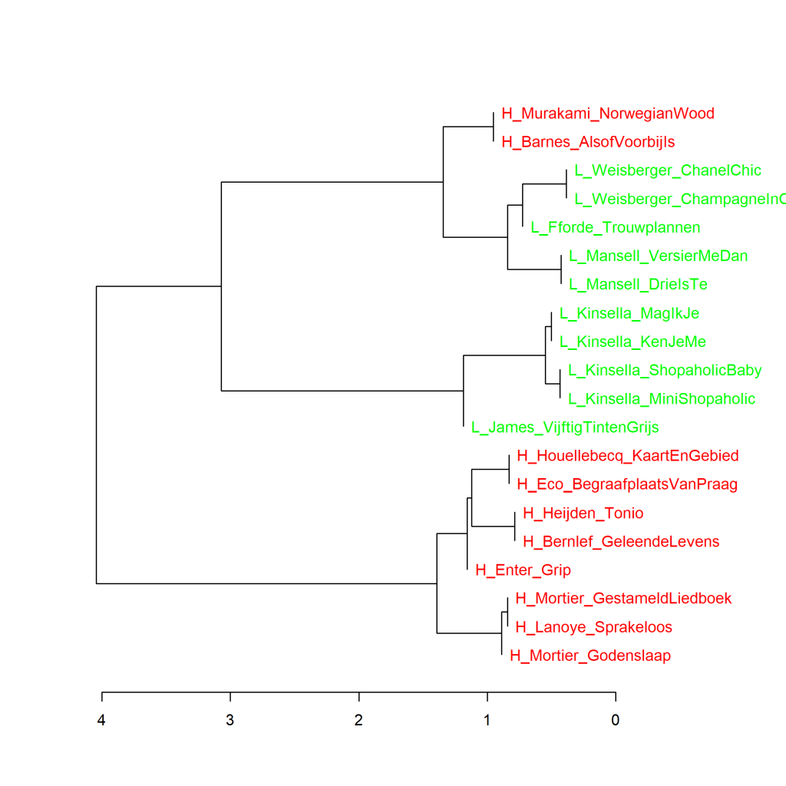

Kleurenversie van de grafiek op p. 73 van *Het raadsel literatuur*.

De 10 romans met de hoogste (H) en laagste (L) scores voor literaire kwaliteit, clusteranalyse (**100** meest frequente woorden).

Maat: Classic Delta (de Deltascore staat aangegeven onder de horizontale as).

Grafiek 4.5 laat zien dat twee boeken uit de top 10, namelijk *Alsof het voorbij is* van Julian Barnes en *Norwegian wood* van Haruki Murakami in het gebruik van de 100 meest frequente woorden meer lijken op de weinig literair gevonden chicklits van Weisberger, Fforde en Mansell en het cluster van weinig literair gevonden boeken van Kinsella en James, dan op de 8 andere romans die de hoogste literaire scores kregen.

### **Extra grafieken Top 10 meest literair en minst literair**
Net als Grafiek 4.5 in het boek zijn de extra grafieken die hieronder staan, gemaakt met het Stylo Package for R, ontwikkeld door Maciej Eder, Mike Kestemont, Jan Rybicki, en Steffen Pielström. Zie <https://github.com/computationalstylistics/stylo> voor meer informatie over Stylo.

Bij Grafiek 4.5.1 staat meer uitleg over analyse op hoofdcomponenten (PCA), bij Grafiek 4.5.2 wordt uitleg gegeven over clusteranalyse en de Delta-score, en bij Grafiek 4.5.3 is meer te vinden over de bootstrap consensus tree.

**Grafiek 4.5.1 Top 10 meest literair en minst literair**

Analyse op hoofdcomponenten (**100** meest frequente woorden). Maat: PCA, correlatieversie.

De grafiek hierboven laat een visualisatie zien van de analyse op hoofdcomponenten voor de 100 meest frequente woorden. De verhoudingen sluiten aan bij wat de clusteranalyse (Grafiek 4.5) al liet zien. In de grafiek hieronder zijn de woorden die opvallend vaker in de verschillende romans voorkomen aan de grafiek toegevoegd. Een voorbeeld: In *Grip* van Stephan Enter wordt het woord *zich* opvallend vaker gebruikt dan in de andere romans; in *Vijftig tinten grijs* van E.L. James valt het groter aandeel van *mijn* op.

Meer over deze maat: In deze analyse op hoofdcomponenten (principal components) wordt berekend wat de correlaties in de frequenties van de gebruikte woorden in de geselecteerde romans zijn. Op basis van die correlaties wordt voor elke roman berekend hoe het boek zich verhoudt tot de andere romans in de selectie. De eerste component reflecteert het cluster aan gecorreleerde variabelen die samen het grootste deel van de variatie in de data verklaren. De tweede hoofdcomponent reflecteert de grootste hoeveelheid correlerende variabelen uit de resterende variabelen (die dus niet correleren met de eerste component). In de visualisatie van een principal components analyse kunnen we zien hoe de teksten zich tot elkaar verhouden op de eerste (horizontaal afgebeelde) en tweede (verticaal afgebeelde) component. Hoe dichter boeken bij elkaar in de buurt staan, hoe meer ze op elkaar lijken in het frequentiepatroon van het gekozen aantal meest frequente woorden. Verwijzingen naar meer uitleg over PCA zijn te vinden op p. 305-306 van *Het raadsel literatuur*.

**Grafiek 4.5.2 Top 10 meest literair en minst literair**

Clusteranalyse (**130** meest frequente woorden). Maat: Classic Delta.

In metingen met 130 meest frequente woorden (MFW) en hoger zijn de 10 meest literair gevonden romans steeds bij elkaar in hetzelfde cluster te vinden. De weinig literair gewaardeerde romans van Weisberger, Fforde en Mansell lijken net iets meer op de 10 meest literaire romans dan op de andere 5 romans, van Kinsella en James. Bij 110 en 120 MFW zien we hetzelfde beeld als in Grafiek 4.5.

Meer over clusteranalyse: In een clusteranalyse worden op statistische gronden de meest op elkaar lijkende teksten op basis van woorden en woordfrequenties steeds twee aan twee met elkaar verbonden, waarna de clusters die het meest op elkaar lijken ook weer twee aan twee aan elkaar worden geknoopt, en zo verder. In de visualisatie van de meting is dat als volgt weergegeven: Hoe verder naar rechts in de grafiek twee boeken of clusters van boeken door een verticale lijn met elkaar verbonden zijn, hoe meer ze op elkaar lijken in de frequentie van de geanalyseerde woorden. Zie *Het raadsel literatuur* p. 72 en p. 164 voor meer informatie over clusteranalyse.

Meer over Classic Delta: De ‘Delta’ is een getal dat aanduidt wat de mate van verschil in woordgebruik en woordfrequenties is tussen teksten die deel uitmaken van een groot corpus van teksten. Voor elke tekst in dat corpus wordt vastgesteld welke verschillende woorden erin voorkomen en hoe vaak elk woord voorkomt. Vervolgens wordt gekeken hoe het gebruik van elk woord in die tekst zich verhoudt tot het gemiddelde gebruik van dat woord in de hele tekstverzameling. Voor alle geselecteerde woorden (bijvoorbeeld de 100 meest frequente of de 1000 meest freuente woorden) worden de afwijkingen van het gebruik ten opzichte van het gemiddelde opgeteld: de ‘Delta’-score. Zie *Het raadsel literatuur* p. 24-25 voor meer informatie over de Delta-score.

**Grafiek 4.5.3 Top 10 meest literair en minst literair**

Bootstrap consensus tree (**100** - **1000** meest frequente woorden, increment van 100, consensus strength 0.5). Maat: Classic Delta.

Zoals hierboven al bleek, is de uitkomst van clusteranalyses gemaakt op basis van verschillende aantallen meest frequente woorden (MFW) niet altijd dezelfde. Het is nuttig om een hele reeks aan verschillende clusteranalyses te doen en daar dan een soort gemiddelde van te berekenen. Dat kan worden gedaan door in Stylo te kiezen voor een bootstrap consensus tree. In de grafiek hieronder is het resultaat gevisualiseerd van het gemiddelde van clusteranalyses gemaakt op basis van de 100 MFW tot en met de 1000 MFW met een increment van 100; dat betekent dat er in totaal tien clusteranalyses zijn gemaakt (100, 200, 300, ...., 900 en 1000 MFW). De gekozen consensus strength is 0,5, wat betekent dat twee romans of clusters aan elkaar geclusterd worden als ze in minimaal de helft van de metingen het meest op elkaar lijken. In Grafiek 4.5.3 is te zien dat de bootstrap consensus analyse in dit geval alle meest literair gevonden boeken bijelkaar clustert tegenover alle romans die het minst literair beschouwd werden.

**Grafiek 4.5.4 Top 10 meest literair en minst literair**

Analyse op hoofdcomponenten (**1000** meest frequente woorden). Maat: PCA, correlatieversie.

In de visualisatie van deze meting zien we dat de 10 meest literair gevonden boeken (H, in rood) samenscholen aan de linkerkant van de grafiek, dat zij het meest verschillen van de minst literair gevonden boeken van James en Kinsella (L, in groen), die rechts in de grafiek opduiken, en dat de ook weinig literair gewaardeerde romans van Fforde, Mansell en Weisberger dichter bij de meest literaire romans staan. Het is hetzelfde beeld als in grafiek 4.5.1, maar de afstanden zijn groter geworden nu we naar de 1000 in plaats van naar de 100 meest frequente woorden hebben gekeken.

**Conclusie**

De conclusie die uit al deze metingen te trekken is (meer hierover in *Het raadsel literatuur* op p. 73 en verder), is dat de meest literair gevonden romans een ander woordfrequentiepatroon hebben dan de minst literaire boeken. Dat heeft echter naar alle waarschijnlijkheid eerder te maken met een genreverschil en genreconventies op het niveau van het woordgebruik dan met een verschil in toegekende literaire kwaliteit.

<!-- **Hoe zijn de metingen te repliceren?**
VOORBEELDQUERY HIER! -->
