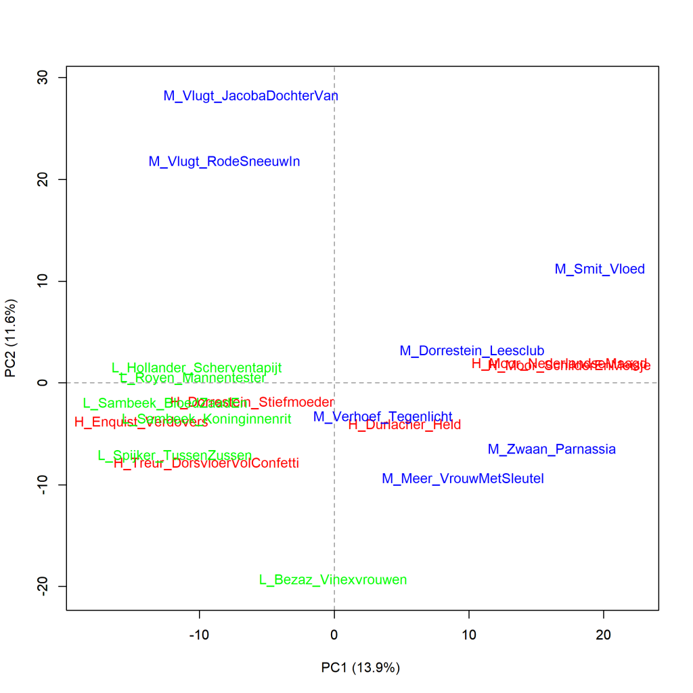

Colour version of the graph on p. 110 of *The Riddle of Literary Quality*.

Dutch Literary novels written by female authors, principal components analysis (1000 most frequent words). Scores for literary quality: H_ (high), L_ (low), en M_ (middle). Measure: PCA, correlation version.

### **Additional graphs: Dutch Literary novels written by female authors (1)**

These graphs have also been created using the Stylo Package for R. See Figure 3.1 for more information about the package and the measures.

**Figure 4.6.1: Dutch Literary novels written by female authors (1)**

Principal components analysis (**100** most frequent words). Measure: PCA, correlation version.

Figure 4.6.1 presents a principal component analysis of the 100 most frequent words, and the graph below shows which words play a role in this analysis. The 'loadings' - which words are remarkably more frequent in which books compared to the others - do not help much further here; it does become clear that the differences are in very common words such as prepositions and adverbs, and perhaps in the predominant narrative tense in the novels (past tense versus present tense).

**More additional graphs and a conclusion on the page with Figure 4.7**
