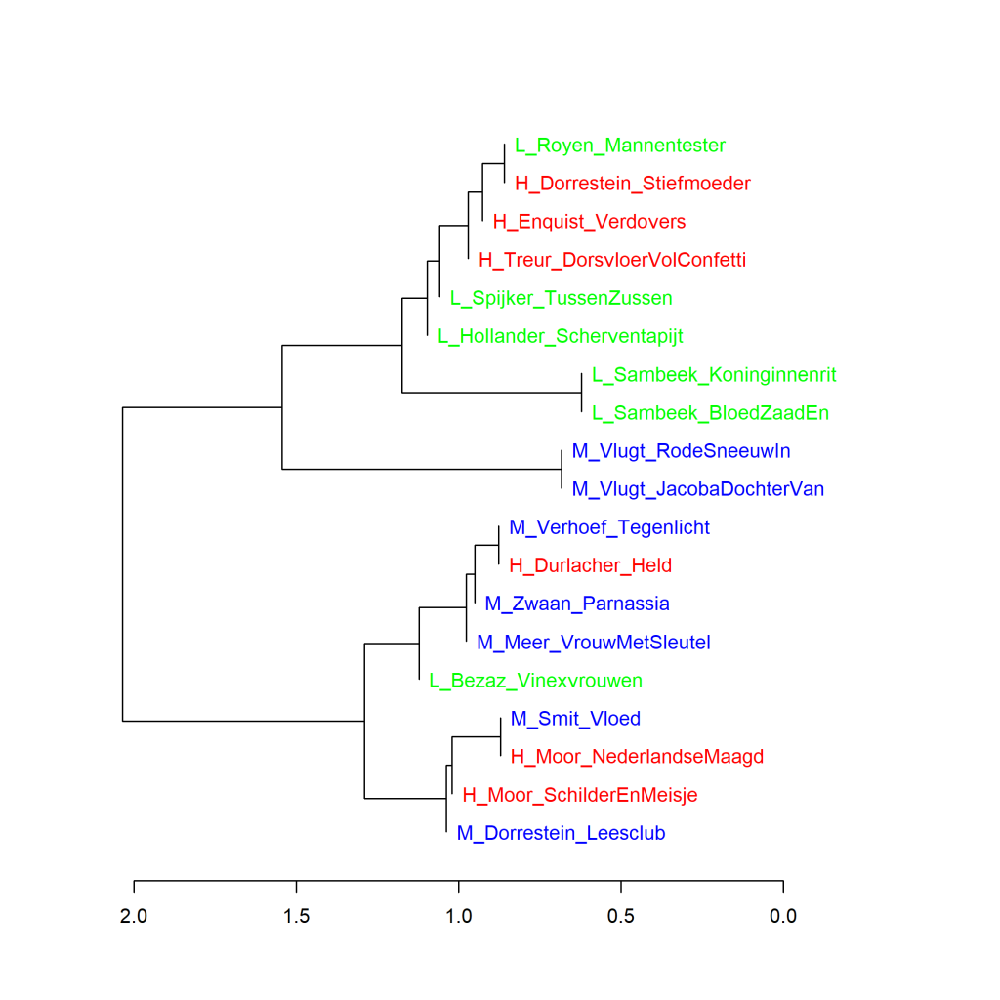

Colour version of the graph on p. 115 of *The Riddle of Literary Quality*.

Dutch Literary novels written by female authors, Cluster Analysis (1000 most frequent words).
Scores for literary quality: H_ (high), L_ (low), and M_ (middle). Measure: Classic Delta.

### **Additional graph: Dutch Literary novels written by female authors (2)**

This graph has also been created using the Stylo Package for R. See Figure 3.1 for more information about the package and the measures.

Figure 4.7 above shows the visualisation of a cluster analysis of the same novels of which Figure 4.6 shows the analysis by main components. Also in the cluster analysis based on the 1000 most frequent words, the groups with different literary quality scores are mixed together. And Renate Dorrestein's two novels are also in two different clusters here. In the additional graph below (4.7.1), we see that even with a whole series of cluster analyses, that picture does not change.

**Figure 4.7.1 Dutch Literary novels written by female authors (2)**

Bootstrap consensus tree (**100** - **1000** most frequent words, increment 100, consensus strength 0.5). Measure: Classic Delta.

**Conclusion**

De extra metingen bevestigen het beeld dat er in de woordfrequenties van de Nederlandse literaire romans van vrouwelijke auteurs geen duidelijk verschil te vinden is tussen de romans die de hoogste of de laagste scores kregen voor literaire kwaliteit of die tot de middengroep behoorden. Meer hierover in *Het raadsel literatuur* op p. 158-159 en 164-165. Het opvallende resultaat voor de twee romans van Renate Dorrestein wordt uitvoerig beschreven op p. 165-173 in *Het raadsel literatuur*.

The additional measurements confirm the picture that no clear difference can be found in the word frequencies of Dutch Literary novels by female authors between the novels that received the highest or lowest scores for literary quality or belonged to the middle group. The striking result for Renate Dorrestein's two novels is described in detail on pp. 115-121 in *The Riddle of Literary Quality*.

