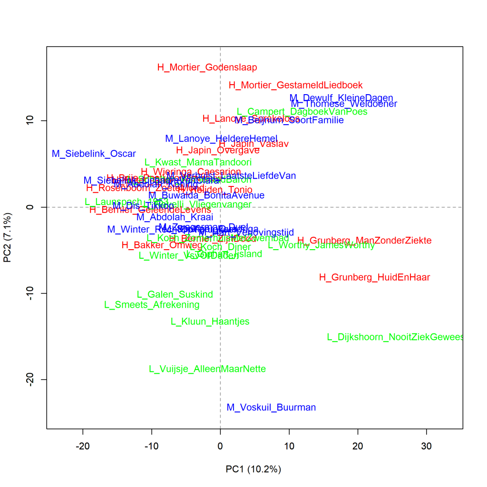

Colour version of the graph on p. 139 of *The Riddle of Literary Quality*.

Dutch Literary novels written by male authors, principal components analysis (1000 most frequent words).
Scores for literary quality: H_ (high), L_ (low), and M_ (middle). Measure: PCA, correlation version.

### **Additional graphs: Dutch Literary novels written by male authors**

These graphs have also been created using the Stylo Package for R. See Figure 3.1 for more information about the package and the measures.

**FIgure 5.5.1: Dutch Literary novels written by male authors**

Cluster analysis (**1000** most frequent words). Measure: Classic Delta.

The visualisation of this cluster analysis also clearly shows that books by the same author tend to be most similar to each other. Furthermore, there are no separate branches for novels that received the highest or lowest scores for literary quality or belonged to the middle group.

**Figure 5.5.2: Dutch Literary novels written by male authors**

Bootstrap consensus tree (**100** - **1000** most frequent words, increment 100, consensus strength 0.5). Measure: Classic Delta.

**Conclusion**

The additional measurements confirm the picture that no clear difference can be found in the word frequencies of Dutch Literary novels by male authors between the novels that received the highest or lowest scores for literary quality or belonged to the middle group.

