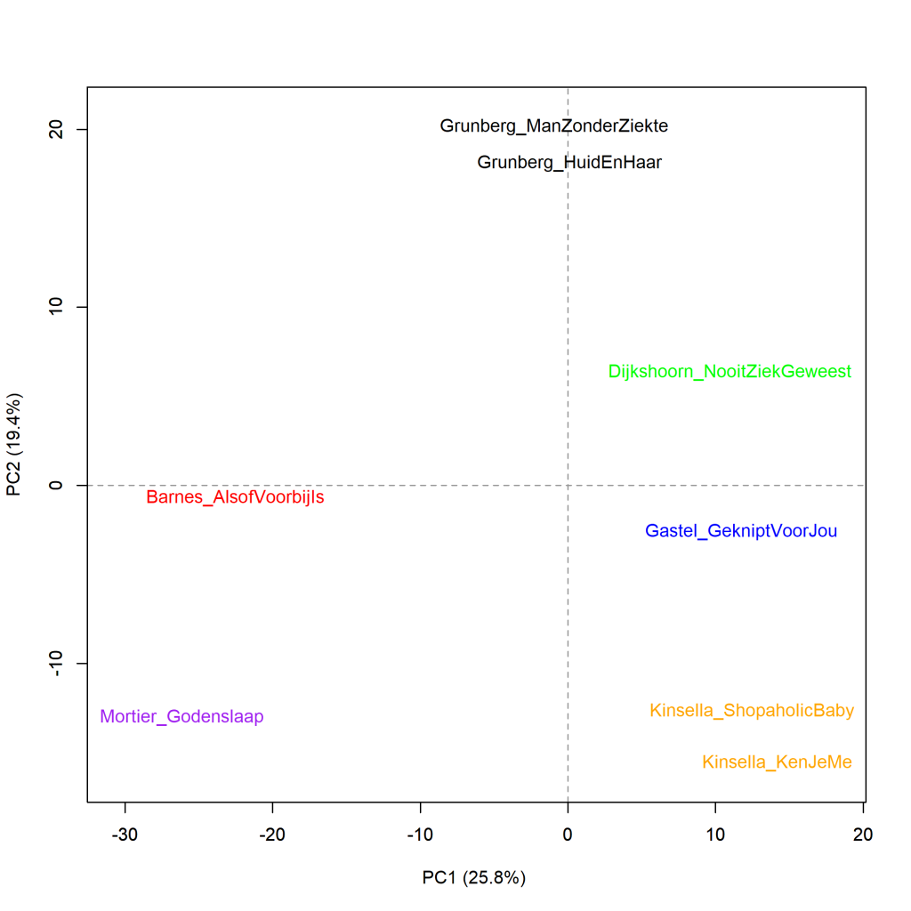

Colour version of the graph on p. 154 of *The Riddle of Literary Quality*.

Grunberg, *Huid en haar* and *De man zonder ziekte*, versus Kinsella, *Shopaholic en baby* and *Ken je me nog?*, added with Van Gastel, *Geknipt voor jou!*, Dijkshoorn, *Nooit ziek geweest*, Barnes, *Alsof het voorbij is* and Mortier, *Godenslaap*. Cluster Analysis (1000 most frequent words). Measure: Classic Delta.

### **Additional graphs: Grunberg and *Shopaholic***

These graphs have also been created using the Stylo Package for R. See Figure 3.1 for more information about the package and the measures.

The cluster analysis visualised in Figure 5.9 was done on the basis of the 1000 most frequent words. Indeed, Grunberg's novels cluster with the selected Romance novels, which received low literary ratings from readers, while Barnes and Mortier's highly rated literary novels together form their own cluster against the other selected novels. We see the same picture when we do a whole series of cluster analyses, visualised in Figure 5.9.1. Again, a principal components analysis (Figure 5.9.2) confirms the overall picture, but does not provide any new insights. 

**Figure 5.9.1: Grunberg, *Huid en haar* and *De man zonder ziekte*, versus Kinsella, *Shopaholic en baby* and *Ken je me nog?*, added with Van Gastel, *Geknipt voor jou!*, Dijkshoorn, *Nooit ziek geweest*, Barnes, *Alsof het voorbij is* and Mortier, *Godenslaap*.**

Bootstrap consensus tree (**100** - **1000** most frequent words, increment 100, consensus strength 0.5). Measure: Classic Delta.

**Figure 5.9.2: Grunberg, *Huid en haar* and *De man zonder ziekte*, versus Kinsella, *Shopaholic en baby* and *Ken je me nog?*, added with Van Gastel, *Geknipt voor jou!*, Dijkshoorn, *Nooit ziek geweest*, Barnes, *Alsof het voorbij is* and Mortier, *Godenslaap*.**

Principal components analysis (**1000** most frequent words). Measure: PCA, correlation version.

**Conclusion**

It remains unclear why the literary Grunberg is more closely aasociated with the not very literary Romance novels; again, more research than that on words alone is needed (and an account of that research is described in Chapter 5 of *The Riddle of Literary Quality*).

