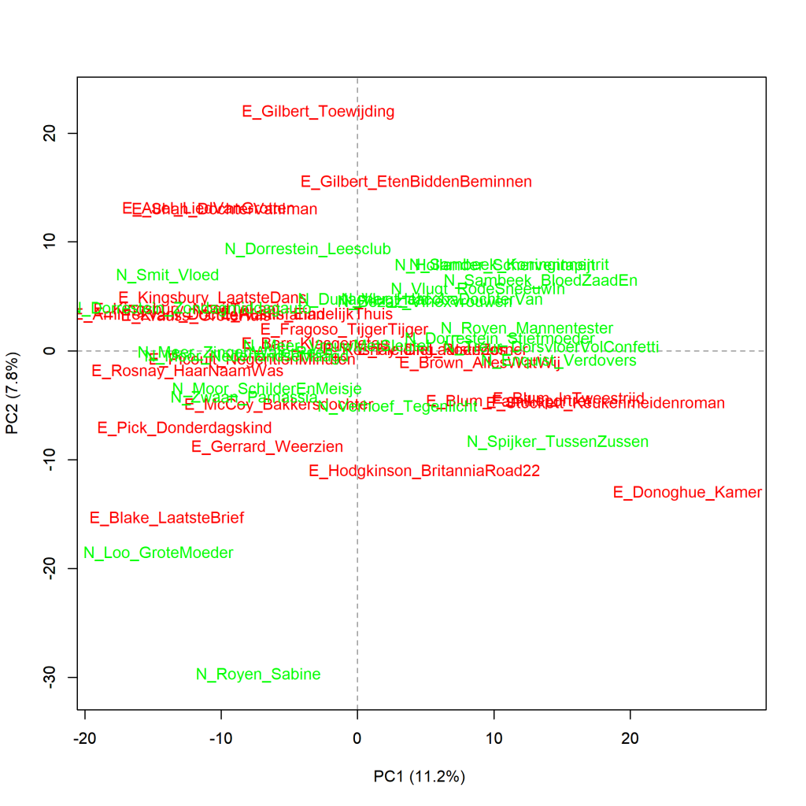
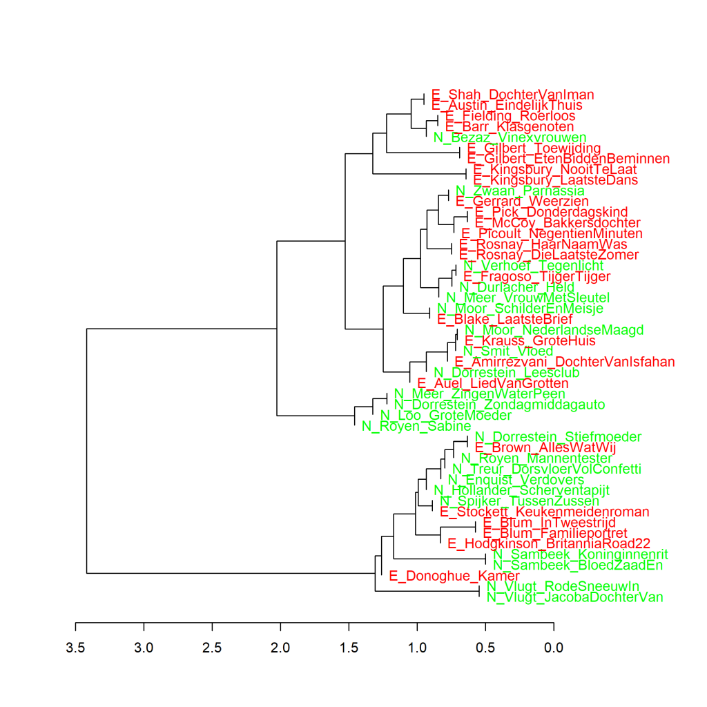
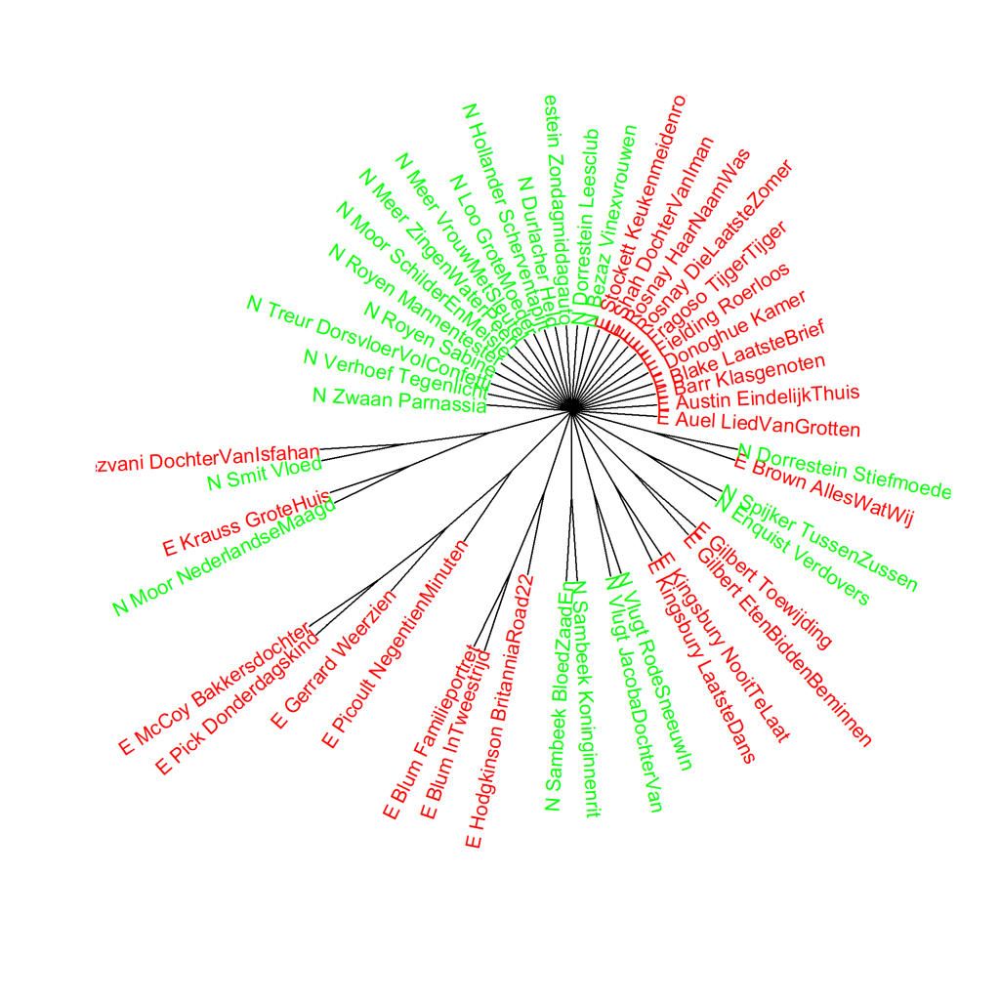

Kleurenversie van de grafiek op p. 117 van *Het raadsel literatuur*.

Nederlandse (N) en uit het Engels vertaalde (E) literaire romans van vrouwelijke auteurs, analyse op hoofdcomponenten (1000 meest frequente woorden). Maat: PCA, correlatieversie.

### **Extra grafieken Nederlandse en uit het Engels vertaalde literaire romans van vrouwelijke auteurs**
Alle gemaakt met het Stylo Package for R. Zie Grafiek 4.5 voor meer informatie over het package en de verschillende maten.

In Grafiek 6.1 is te zien dat de Nederlandse (N) en uit het Engels vertaalde (E) literaire romans van vrouwelijke auteurs in het frequentiegebruik van de 1000 meest gebruikte woorden niet als twee verschillende clusters in de visualisatie verschijnen. Ook een clusteranalyse (Grafiek 6.1.1 hieronder) en een bootstrap consensus tree (Grafiek 6.1.2 hieronder) op basis van 1000 meest frequente woorden presenteren hetzelfde beeld.

**Grafiek 6.1.1 Nederlandse en uit het Engels vertaalde literaire romans van vrouwelijke auteurs**

Clusteranalyse (**1000** meest frequente woorden). Maat: Classic Delta.

In de visualisatie van deze clusteranalyse is weer heel duidelijk te zien dat boeken van dezelfde auteur meestal het dichtste bij elkaar clusteren, waardoor het auteursherkennend vermogen van deze methode weer duidelijk wordt. Uitzonderingen op dat patroon, zoals de romans van Renate Dorrestein, zijn extra interessant.

Het cluster van vier boeken die in Grafiek 6.1.1 het verst af staan van de andere titels (die in de visualisatie het verst naar links clusteren) zijn trouwens alle vier korte verhalen. De aanzienlijk kleinere omvang van de vier titels is waarschijnlijk de reden voor hun uitzonderlijke plaats. Dit zien we vaker in dit soort metingen; reden waarom ze in latere metingen buiten de vergelijking zijn gehouden (zie onder meer *Het raadsel literatuur* p. 148 en p. 199).

**Grafiek 6.1.2 Nederlandse en uit het Engels vertaalde literaire romans van vrouwelijke auteurs**

Bootstrap consensus tree (**100** - **1000** meest frequente woorden, increment van 100, consensus strength 0.5). Maat: Classic Delta.

In Grafiek 6.1.2 zijn er aan de bovenkant heel wat Nederlandse en uit het Engels vertaalde romans die rechtstreeks verbonden zijn met het centrum van de grafiek. Dat betekent dat de software voor al deze romans niet kon vaststellen op welke andere roman ze het meeste leken. De plaats die ze innemen in de visualisatie zegt dus niets over de onderlinge verhoudingen.

**Conclusie**

In de frequenties van de 1000 meest gebruikte woorden is geen duidelijk verschil te vinden tussen de geselecteerde oorspronkelijk in het Nederlands geschreven literaire romans en uit het Engels vertaalde literaire romans van vrouwelijke auteurs. Meer hierover in *Het raadsel literatuur* op p. 117 en verder.

<!-- **Hoe zijn de metingen te repliceren?**
VOORBEELDQUERY HIER! -->
