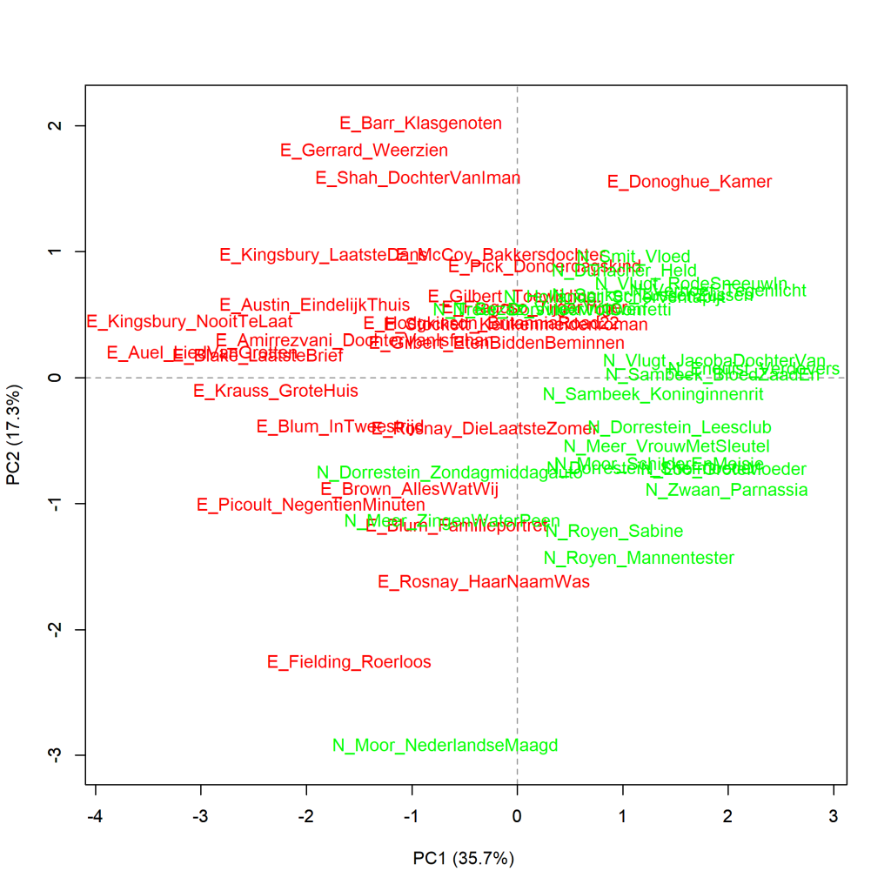
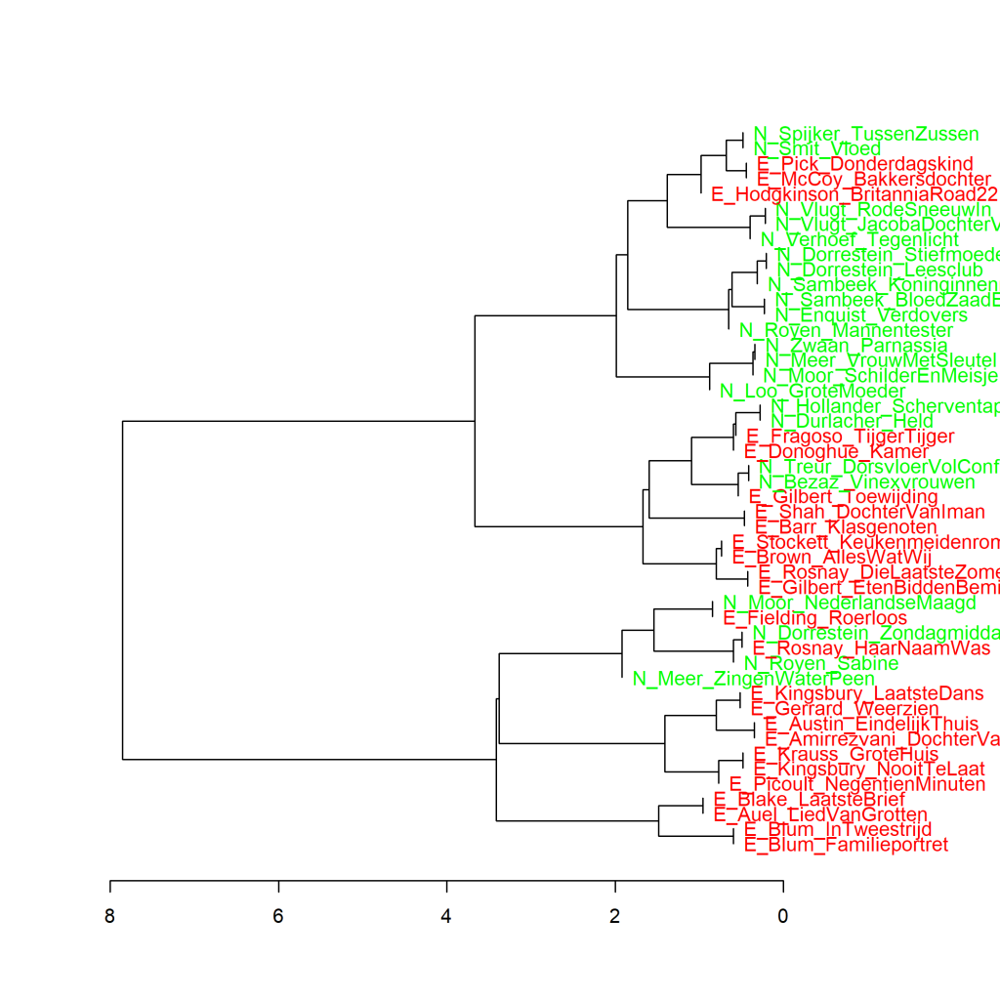

Kleurenversie van de grafiek op p. 118 van *Het raadsel literatuur*.

De voegwoorden *en*, *toen*, *dat*, *voordat*, *terwijl* en *hoewel* in de Nederlandse (N) en uit het Engels
vertaalde (E) literaire romans van vrouwelijke auteurs, analyse op hoofdcomponenten. Maat: PCA, correlatieversie.

### **Extra grafiek Voegwoorden in Nederlandse en uit het Engels vertaalde literaire romans van vrouwelijke auteurs**
Ook deze grafiek is gemaakt met het Stylo Package for R. Zie Grafiek 4.5 voor meer informatie over het package en de verschillende maten.

**Grafiek 6.2.1 Voegwoorden in Nederlandse en uit het Engels vertaalde literaire romans van vrouwelijke auteurs**

De voegwoorden *en*, *toen*, *dat*, *voordat*, *terwijl* en *hoewel* in de Nederlandse (N) en uit het Engels
vertaalde (E) literaire romans van vrouwelijke auteurs, analyse op hoofdcomponenten. Clusteranalyse (6 woorden). Maat: Classic Delta.

In Grafiek 6.2.1 is dezelfde ruwe tweedeling te zien als in de visualisatie van de analyse op hoofdcomponenten in Grafiek 6.2. Wat hier opvalt is dat de twee romans van Renate Dorrestein die in Grafiek 6.1 in verschillende clusters terecht kwamen hier wel het meest op elkaar lijken. Het verschil tussen die twee romans zit hem dus niet in een verschillende omgang met deze zes voegwoorden.

**Conclusie**

In de geselecteerde romans is er een redelijk zichtbaar verschil in de frequentie van de zes voegwoorden in oorspronkelijk Nederlandse literaire romans van vrouwelijke auteurs en literaire romans vertaald uit het Engels. Het lijkt er dus op, dat vertalers onder invloed van de brontaal (het Engels) in hun gebruik van deze voegwoorden in hun doeltekst (de vertaling in het Nederlands) een ander frequentiepatroon hanteren dan de auteurs die hun romans rechtstreeks in het Nederlands schreven. Dat is waarschijnlijk een onbewust proces, maar lezers kunnen dat, net zo onbewust, toch merken bij het lezen en daardoor weten dat ze met een vertaling te maken hebben. En dat onbewuste gevoel kan weer invloed hebben op de score die ze een boek geven voor literaire kwaliteit. Meer hierover in *Het raadsel literatuur* op p. 118 en verder.

<!-- **Hoe zijn de metingen te repliceren?**
VOORBEELDQUERY HIER! -->
