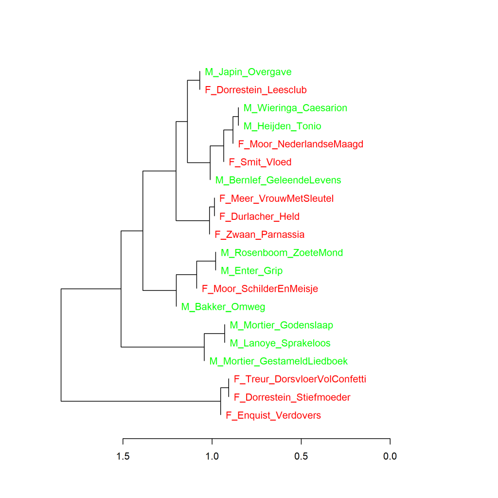
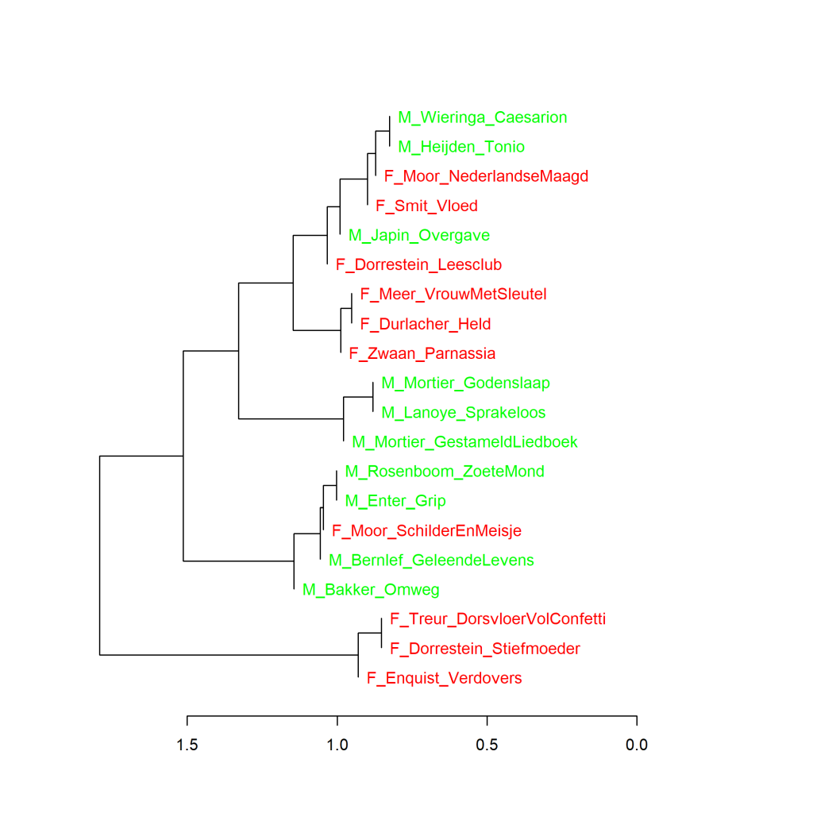
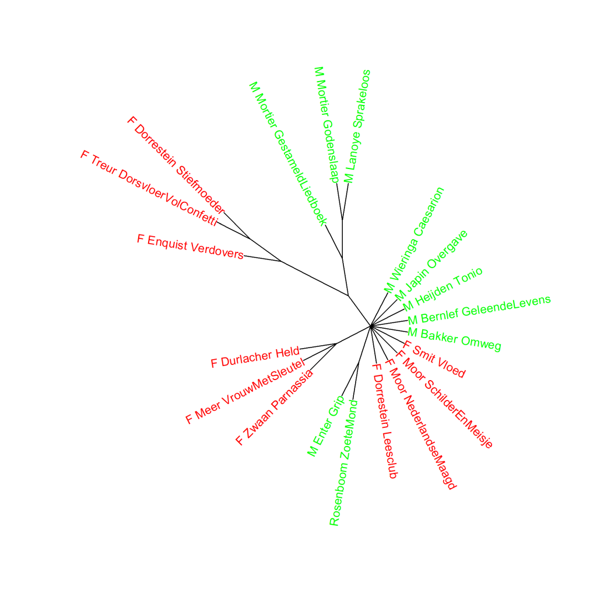

Kleurenversie van de grafiek op p. 287 van *Het raadsel literatuur*.

Top 10 literaire kwaliteit van Nederlandse literaire romans van mannen (M) en van vrouwen (F), clusteranalyse (1000 meest frequente woorden). Maat: Classic Delta. CORRECTIE: Deze grafiek geeft niet de clusteranalyse van de **1000 meest frequente woorden** weer, maar die van de **726 woorden die in alle 20 romans voorkomen** (dat wil zeggen: met 100 procent 'culling'). De grafiek zoals ik hem had bedoeld, staat hieronder bij de extra grafieken als Grafiek 11.2.1.

### **Extra grafieken Nederlandse literaire romans van mannelijke en vrouwelijke auteurs (1)**

Ook deze grafieken zijn gemaakt met het Stylo Package for R. Zie  Grafiek 4.5 voor meer informatie over het package en de verschillende maten.

Grafiek 11.2.1 presenteert de grafiek zoals die in het boek had moeten staan; er zijn geen verschillen in de twee hoofdclusters, en dezelfde drie romans vormen samen een van de twee hoofdclusters. Ook nu staan de twee romans van Renate Dorrestein elk in een van die twee hoofdclusters. In het grootste cluster staan de drie romans van Vlaamse auteurs (een van Lanoye en twee van Mortier) bij elkaar in een subcluster. Een hele reeks van clusteranalyses geeft hetzelfde beeld, zoals gevisualiseerd in Grafiek 11.2.2.

**Grafiek 11.2.1 Nederlandse literaire romans van mannelijke en vrouwelijke auteurs**

Clusteranalyse (**1000** meest frequente woorden). Maat: Classic Delta.

**Grafiek 11.2.2 Nederlandse literaire romans van mannelijke en vrouwelijke auteurs**

Bootstrap consensus tree (**100** - **1000** meest frequente woorden, increment van 100, consensus strength 0.5). Maat: Classic Delta.

**Meer extra grafieken en een conclusie bij Grafiek 11.3**
