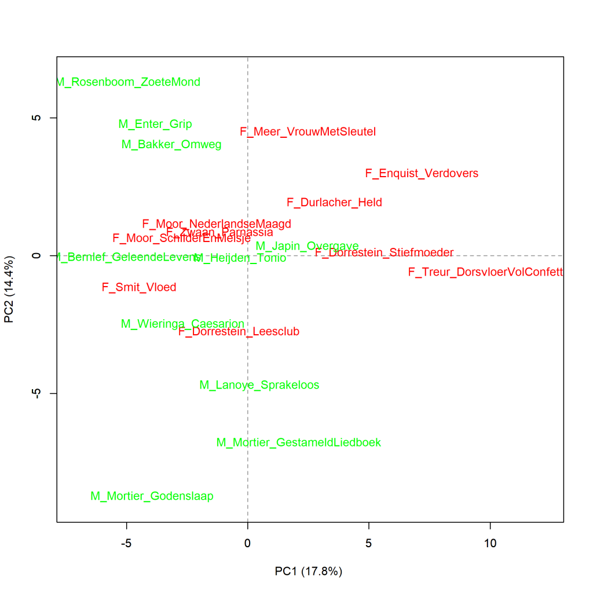

Kleurenversie van de grafiek op p. 288 van *Het raadsel literatuur*.

Top 10 literaire kwaliteit van Nederlandse literaire romans van mannen (M) en van vrouwen (F), analyse op hoofdcomponenten (1000 meest frequente woorden). Maat: PCA, correlatieversie.

### **Extra grafieken Nederlandse literaire romans van mannelijke auteurs (2)**

Ook deze grafieken zijn gemaakt met het Stylo Package for R. Zie  Grafiek 4.5 voor meer informatie over het package en de verschillende maten.

Grafiek 11.3 geeft een vergelijkbaar beeld als de visualisatie van de clusteranalyse in Grafiek 11.2. Om toch iets meer inzicht te krijgen in de onderlinge verschillen staat hieronder een weergave van een analyse op hoofdcomponenten van alleen de 100 meest frequente woorden (Graiek 11.3.1) en welke woorden daarin een opvallende rol spelen (Grafiek 11.3.2). Ook hier blijken dat heel gewone woorden te zijn, die ons weinig kunnen helpen in het verder nadenken over wat voor invloed die hebben op de waardeoordelen over literaire kwaliteit. Het lijkt erop dat een overwegende tegenwoordige tijd of verleden tijd een rol speelt op de eerste component. Verder komt het zelfstandig naamwoord *moeder* in de buurt van twee romans over dementerende moeders (van de mannelijke auteurs Lanoye en Mortier) voor, wat aangeeft dat dit woord daarin een relatief hogere frequentie heeft; dat is niet vreemd gezien het onderwerp van de romans. De twee andere zelfstandig naamwoorden in deze grafiek zijn *man* en *vader*, en beide zijn opvallend vaker gebruikt in romans van vrouwelijke auteurs.

**Grafiek 11.3.1 Nederlandse literaire romans van mannelijke en vrouwelijke auteurs**

Analyse op hoofdcomponenten (**100** meest frequente woorden). Maat: PCA, correlatieversie.

**Grafiek 11.3.2 Nederlandse literaire romans van mannelijke en vrouwelijke auteurs**

Analyse op hoofdcomponenten (**100** meest frequente woorden). Maat: PCA, correlatieversie.

**Conclusie**

De extra metingen bevestigen het beeld dat er in de woordfrequenties van de top 10 Nederlandse literaire romans van vrouwelijke en mannelijke auteurs geen duidelijk scheidslijn te vinden is tussen de romans van vrouwen en die van mannen. Zie *Het raadsel literatuur*, p. 288 en verder.

<!-- **Hoe zijn de metingen te repliceren?**
VOORBEELDQUERY HIER! -->
