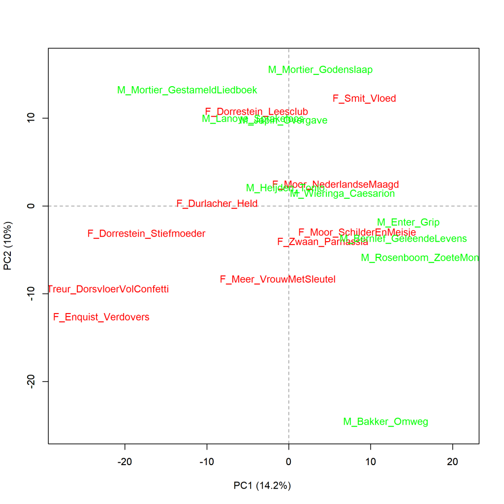
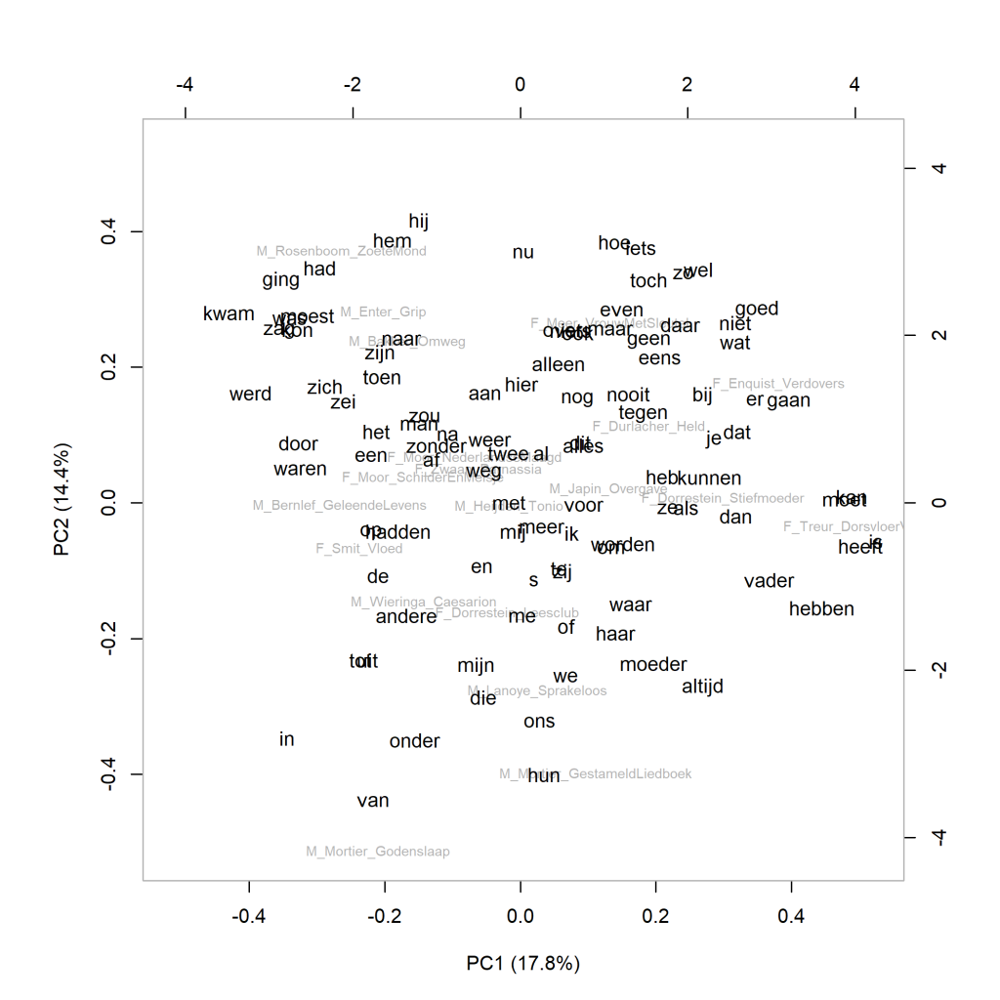

Colour version of the graph on p. 174 of *The Riddle of Literary Quality*.

Literary quality top 10 of Dutch-language novels by female (F_) and male (M_) authors,principal components analysis (1000 most frequent words). Measure: PCA, correlation version.

### **Additional graphs: Literary quality top 10 of Dutch-language novels by female and male authors (2)**

These graphs have also been created using the Stylo Package for R. See Figure 3.1 for more information about the package and the measures.

Figure 6.5 presents a similar picture to the visualisation of the cluster analysis in Figure 6.4. Still, to get a little more insight into the differences between them, below is a representation of a principal components analysis of only the 100 most frequent words (Figure 6.5.1) and which words play a salient role in them (Figure 6.5.2). Again, these appear to be very common words, which can do little to help us in thinking further about what influence they have on value judgements about literary quality. It seems that a predominant present tense or past tense plays a role on the first component. Furthermore, the noun *mother* appears in the vicinity of two novels about demented mothers (by male authors Lanoye and Mortier), indicating that this word has a relatively higher frequency in them; this is not surprising given the subject matter of the novels. The two other nouns in this graph are *man* and *father*, and both are remarkably more frequently used in novels by female authors.

**Figure 6.5.1: Literary quality top 10 of Dutch-language novels by female and male authors**

Principal components analysis (**100** most frequent words). Measure: PCA, correlation version.

**Figure 6.5.2: Literary quality top 10 of Dutch-language novels by female and male authors**

Principal components analysis (**100** most frequent words). Measure: PCA, correlation version.

**Conclusion**

The additional measurements confirm the view that there is no clear dividing line between women's and men's novels in the word frequencies of the top 10 Dutch literary novels by female and male authors. See chapter 6 of *The Riddle of Literary Quality* for more information.

