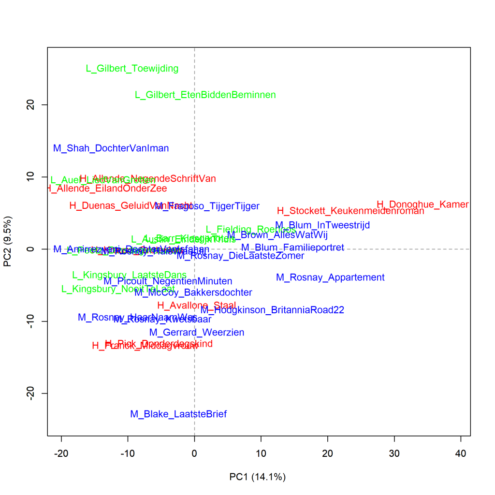
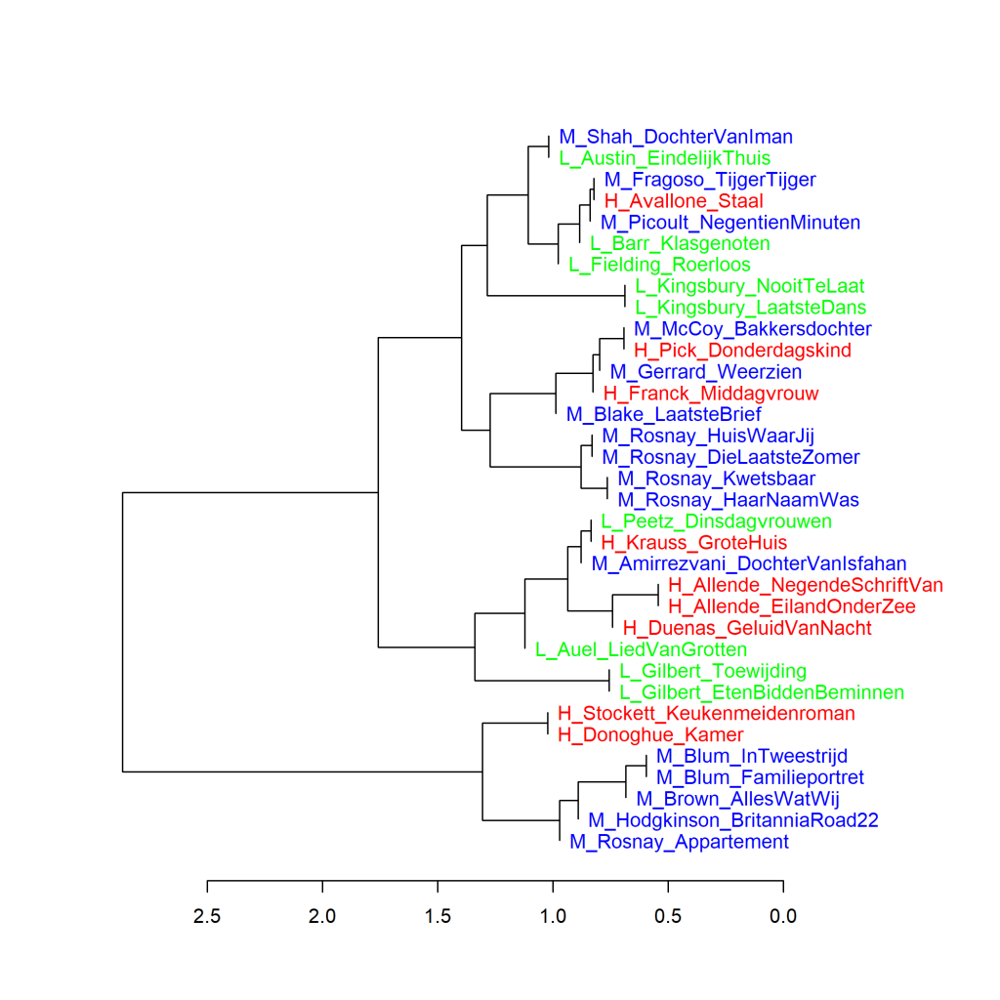
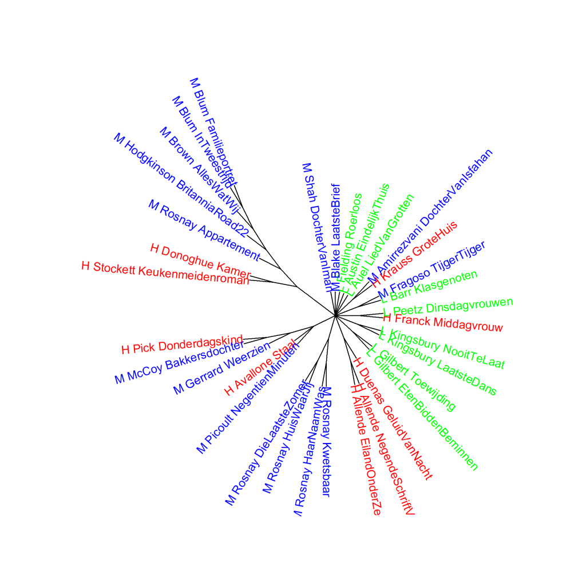

Kleurenversie van de grafiek op p. 141 van *Het raadsel literatuur*.

Vertaalde literaire romans van vrouwelijke auteurs, analyse op hoofdcomponenten (1000 meest frequente woorden).
Scores voor literaire kwaliteit: H (hoog), L (laag), en M (midden). Maat: PCA, correlatieversie.

### **Extra grafieken Vertaalde literaire romans van vrouwelijke auteurs**
Ook deze grafiek is gemaakt met het Stylo Package for R. Zie  Grafiek 4.5 voor meer informatie over het package en de verschillende maten.

Grafiek 7.3.1 presenteert een clusteranalyse (Grafiek 6.1.1 hieronder) en Grafiek 7.3.2 een bootstrap consensus tree van dezelfde drie groepen vertaalde literaire romans van vrouwelijke auteurs als in Grafiek 7.3.

**Grafiek 7.3.1 Vertaalde literaire romans van vrouwelijke auteurs**

Clusteranalyse (**1000** meest frequente woorden). Maat: Classic Delta.

Ook in de visualisatie van deze clusteranalyse is duidelijk te zien dat boeken van dezelfde auteur meestal het meest op elkaar lijken. Verder zijn er geen aparte takken voor romans die de hoogste of de laagste scores kregen voor literaire kwaliteit of die tot de middengroep behoorden.

**Grafiek 7.3.2 Vertaalde literaire romans van vrouwelijke auteurs**

Bootstrap consensus tree (**100** - **1000** meest frequente woorden, increment van 100, consensus strength 0.5). Maat: Classic Delta.

Als we een hele serie aan clusteranalyses maken, blijft het patroon hetzelfde.

**Conclusie**

Voor de vertaalde literaire romans van vrouwelijke auteurs zien we in de frequenties van de 1000 meest gebruikte woorden geen duidelijk verschil tussen de romans die de hoogste of de laagste scores kregen voor literaire kwaliteit of die tot de middengroep behoorden. Meer hierover in *Het raadsel literatuur* op p. 140 en verder.

<!-- **Hoe zijn de metingen te repliceren?**
VOORBEELDQUERY HIER! -->
