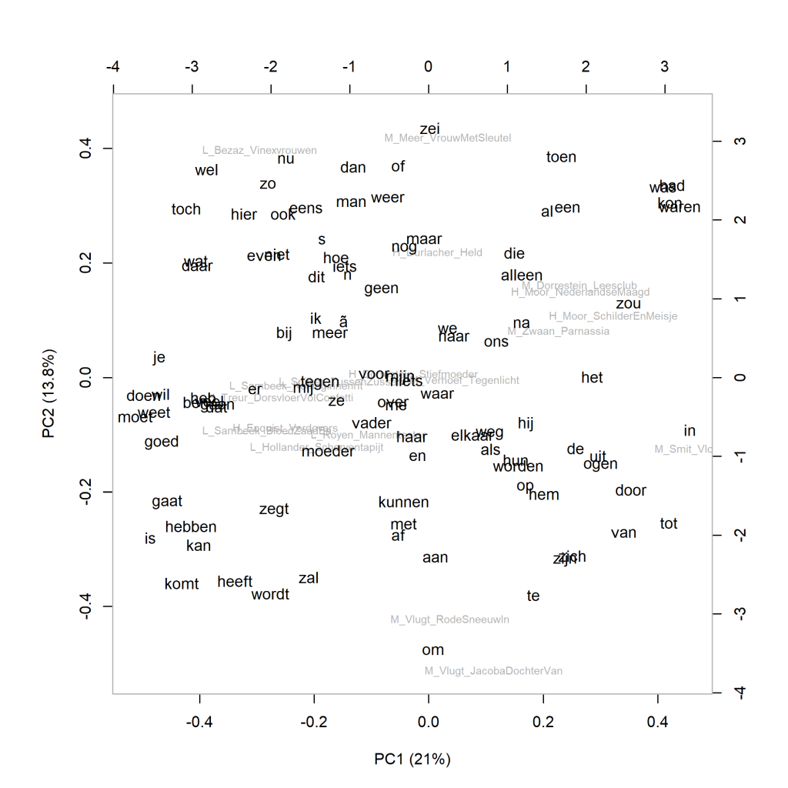

Kleurenversie van de grafiek op p. 159 van *Het raadsel literatuur*.

Nederlandse literaire romans van vrouwelijke auteurs, analyse op hoofdcomponenten (1000 meest frequente woorden).
Scores voor literaire kwaliteit: H (hoog), L (laag), en M (midden). Maat: PCA, correlatieversie.

### **Extra grafieken Nederlandse literaire romans van vrouwelijke auteurs (1)**

Ook deze grafieken zijn gemaakt met het Stylo Package for R. Zie  Grafiek 4.5 voor meer informatie over het package en de verschillende maten.

**Grafiek 7.6.1 Nederlandse literaire romans van vrouwelijke auteurs (1)**

Analyse op hoofdcomponenten (**100** meest frequente woorden). Maat: PCA, correlatieversie.

Grafiek 7.6.1 presenteert een analyse op hoofdcomponenten van de 100 meest frequente woorden, en in de grafiek hieronder is te zien welke woorden in deze analyse een rol spelen.  De 'loadings' - welke woorden opvallend vaker voorkomen in welke boeken vergeleken met de andere boeken - helpen niet veel verder hier; het wordt wel duidelijk dat de verschillen zitten in heel gewone woorden zoals voorzetsels en bijwoorden, en wellicht in de overheersende verteltijd in de romans (verleden tijd tegenover tegenwoordige tijd).

**Meer extra grafieken en een conclusie bij Grafiek 7.7**
