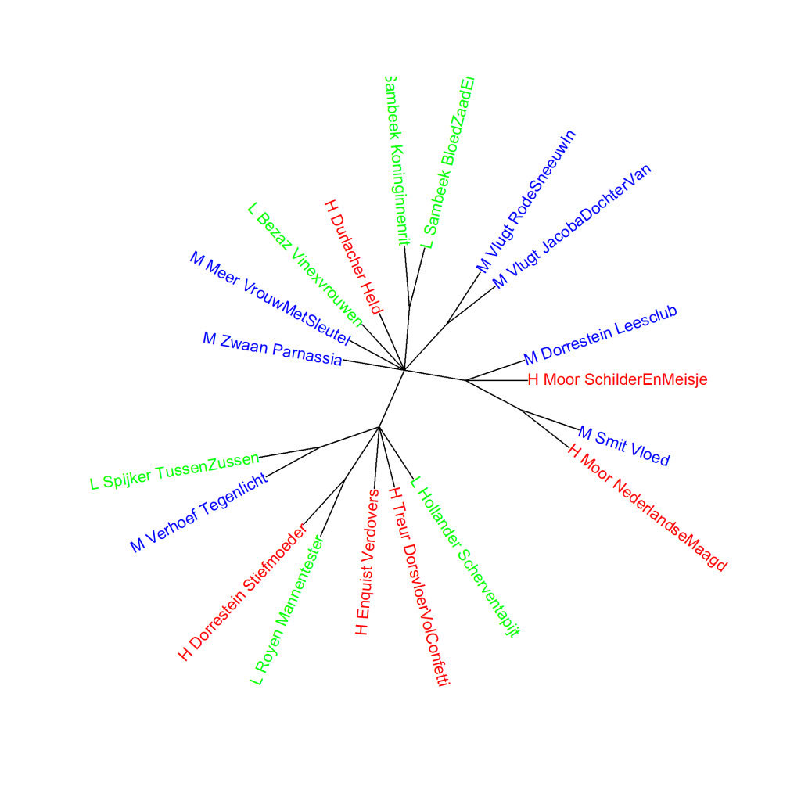

Kleurenversie van de grafiek op p. 165 van *Het raadsel literatuur*.

Nederlandse literaire romans van vrouwelijke auteurs, clusteranalyse (1000 meest frequente woorden).
Scores voor literaire kwaliteit: H (hoog), L (laag), en M (midden). Maat: Classic Delta.

### **Extra grafiek Nederlandse literaire romans van vrouwelijke auteurs (2)**

Ook deze grafiek is gemaakt met het Stylo Package for R. Zie  Grafiek 4.5 voor meer informatie over het package en de verschillende maten.

Grafiek 7.7 hierboven toont de visualisatie van een clusteranalyse van dezelfde romans waarvan Grafiek 7.6 de analyse op hoofdcomponenten laat zien. Ook in de clusteranalyse op basis van de 1000 meest frequente woorden staan de groepen met verschillende scores voor literaire kwaliteit door elkaar heen. En de twee romans van Renate Dorrestein staan ook hier in twee verschillende clusters. In de extra grafiek hieronder (7.7.1) zien we dat ook bij een hele serie aan clusteranalyses dat beeld niet wijzigt.

**Grafiek 7.7.1 Nederlandse literaire romans van vrouwelijke auteurs (2)**

Bootstrap consensus tree (**100** - **1000** meest frequente woorden, increment van 100, consensus strength 0.5). Maat: Classic Delta.

**Conclusie**

De extra metingen bevestigen het beeld dat er in de woordfrequenties van de Nederlandse literaire romans van vrouwelijke auteurs geen duidelijk verschil te vinden is tussen de romans die de hoogste of de laagste scores kregen voor literaire kwaliteit of die tot de middengroep behoorden. Meer hierover in *Het raadsel literatuur* op p. 158-159 en 164-165. Het opvallende resultaat voor de twee romans van Renate Dorrestein wordt uitvoerig beschreven op p. 165-173 in *Het raadsel literatuur*.

<!-- **Hoe zijn de metingen te repliceren?**
VOORBEELDQUERY HIER! -->
