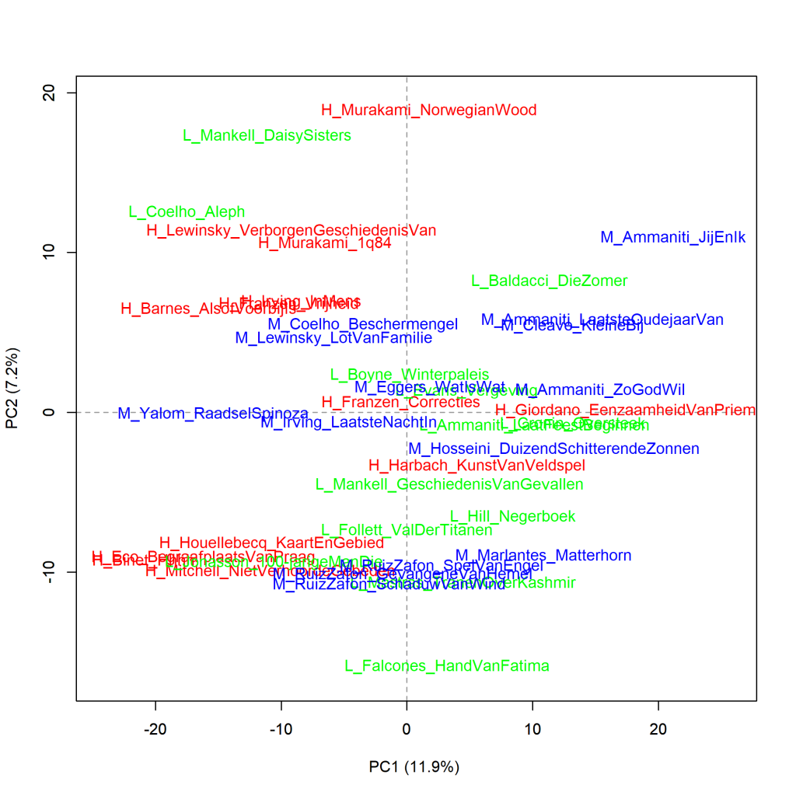
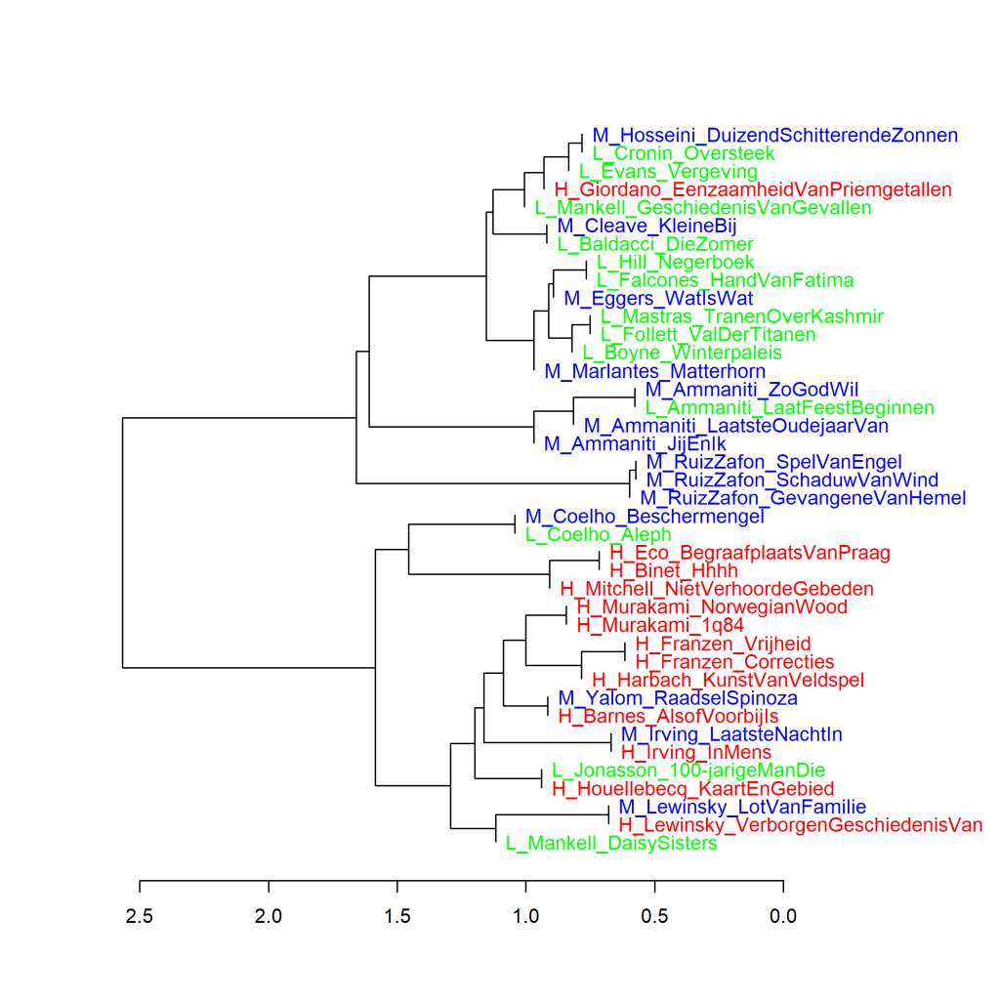
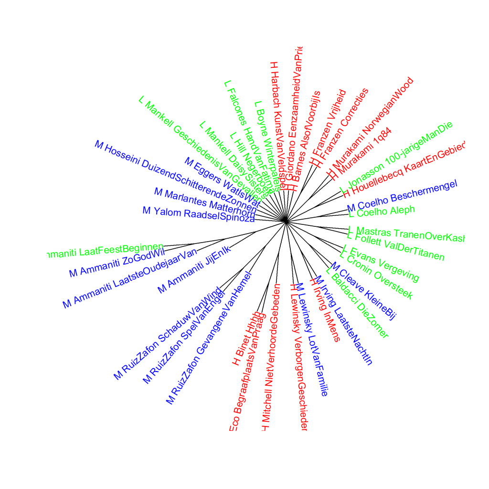

Kleurenversie van de grafiek op p. 190 van *Het raadsel literatuur*.

Vertaalde literaire romans van mannelijke auteurs, analyse op hoofdcomponenten (1000 meest frequente woorden).
Scores voor literaire kwaliteit: H (hoog), L (laag), en M (midden). Maat: PCA, correlatieversie.

### **Extra grafieken Vertaalde literaire romans van mannelijke auteurs**

Ook deze grafieken zijn gemaakt met het Stylo Package for R. Zie  Grafiek 4.5 voor meer informatie over het package en de verschillende maten.

Grafiek 8.2.1 presenteert een clusteranalyse en Grafiek 8.2.2 een bootstrap consensus tree van dezelfde drie groepen vertaalde literaire romans van mannelijke auteurs als in Grafiek 8.2.

**Grafiek 8.2.1 Vertaalde literaire romans van mannelijke auteurs**

Clusteranalyse (**1000** meest frequente woorden). Maat: Classic Delta.

Ook in de visualisatie van deze clusteranalyse is duidelijk te zien dat boeken van dezelfde auteur meestal het meest op elkaar lijken. Verder zijn er geen aparte takken voor romans die de hoogste of de laagste scores kregen voor literaire kwaliteit of die tot de middengroep behoorden. Opvallend is dat de twee romans van Henning Mankell in verschillende clusters verschijnen, net als de twee romans van Renate Dorrestein in Grafiek 7.6 en 7.7.

**Grafiek 8.2.2 Vertaalde literaire romans van mannelijke auteurs**

Bootstrap consensus tree (**100** - **1000** meest frequente woorden, increment van 100, consensus strength 0.5). Maat: Classic Delta.

Ook als we een hele serie aan clusteranalyses maken, blijft het patroon hetzelfde. De twee romans van Mankell zijn in de visualisatie allebei verbonden met het centrum van de grafiek, wat betekent dat voor deze twee boeken (en de andere die op dezelfde manier in de visualisatie staan) niet vast te stellen was op welke van de andere romans het boek het meeste leek. Ze lijken dus ook in deze meting niet het meeste op elkaar.

**Conclusie**

Voor de vertaalde literaire romans van mannelijke auteurs zien we in de frequenties van de 1000 meest gebruikte woorden geen duidelijk verschil tussen de romans die de hoogste of de laagste scores kregen voor literaire kwaliteit of die tot de middengroep behoorden. Meer hierover in *Het raadsel literatuur* op p. 188 en verder. De romans van Mankell vragen om aparte aandacht, die ze krijgen in Grafiek 8.3.

<!-- **Hoe zijn de metingen te repliceren?**
VOORBEELDQUERY HIER! -->
