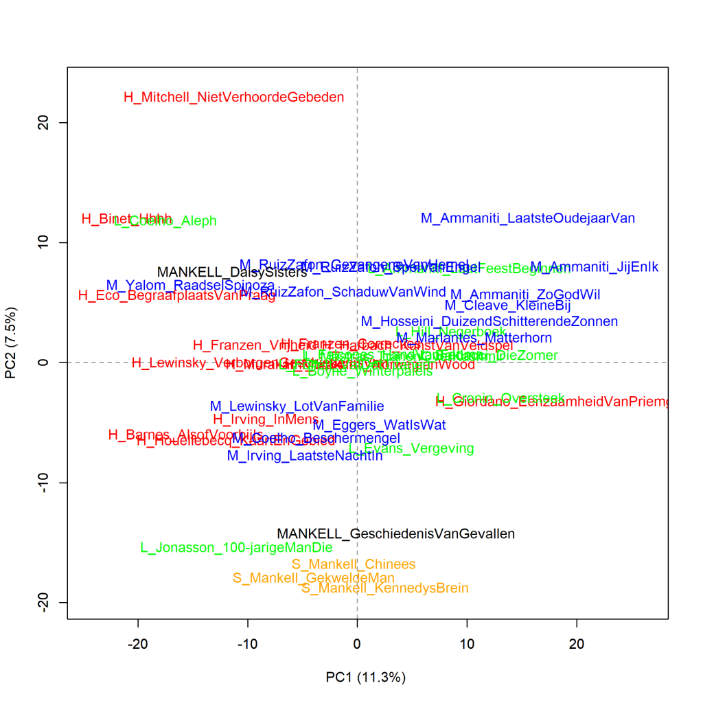
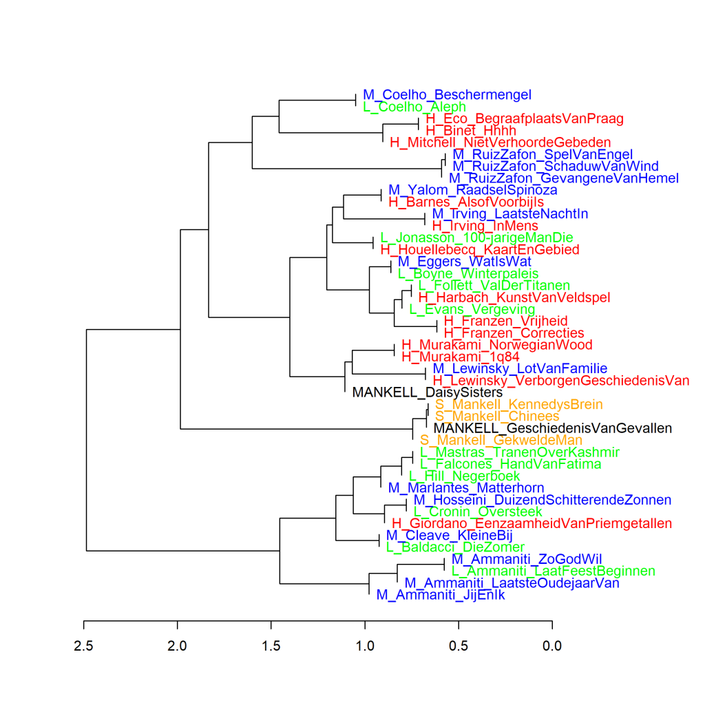
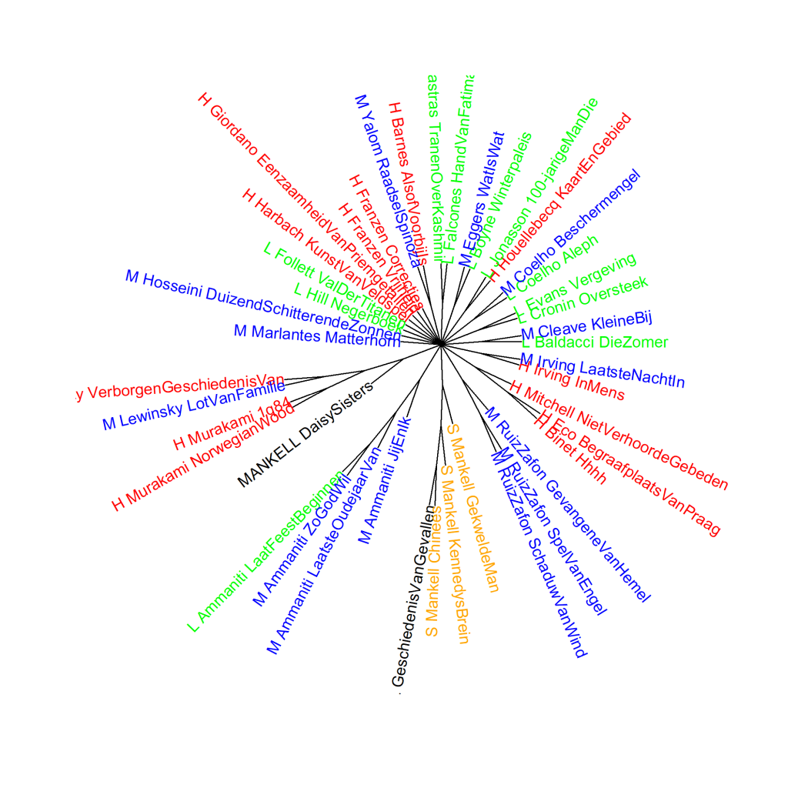

Kleurenversie van de grafiek op p. 195 van *Het raadsel literatuur*.

Vertaalde literaire romans van mannelijke auteurs en drie spannende boeken van Mankell, analyse op hoofdcomponenten (1000 meest frequente woorden). S: de drie spannende boeken van Henning Mankell. De twee literaire romans van zijn hand zijn gemarkeerd
door de auteursnaam in hoofdletters.
Scores voor literaire kwaliteit: H (hoog), L (laag), en M (midden). Maat: PCA, correlatieversie.

### **Extra grafiek Vertaalde literaire romans van mannelijke auteurs en drie spannende boeken van Mankell**

Ook deze grafiek is gemaakt met het Stylo Package for R. Zie  Grafiek 4.5 voor meer informatie over het package en de verschillende maten.

Grafiek 8.3.1 presenteert een clusteranalyse en Grafiek 8.3.2 een bootstrap consensus tree van dezelfde vertaalde romans van mannelijke auteurs als in Grafiek 8.3. in vergelijking met Grafiek 8.2 staan romans die ook in Grafiek 8.3 voorkomen vaak op een andere plaats in de visualisatie. Dat komt omdat er nu drie romans aan zijn toegevoegd, en de meting steeds analyseert hoe de romans zich tot elkaar verhouden. Bij toevoegingen of wijzigingen verandert de samenstelling van het corpus als geheel, en veranderen de onderlinge verhoudingen daardoor ook. Dat is zichtbaar in de grafieken.

**Grafiek 8.3.1 Vertaalde literaire romans van mannelijke auteurs en drie spannende boeken van Mankell**

Clusteranalyse (**1000** meest frequente woorden). Maat: Classic Delta.

Ook in de visualisatie van deze clusteranalyse is duidelijk te zien dat boeken van dezelfde auteur gewoonlijk het meest op elkaar lijken. Vier van de vijf romans van Mankell clusteren bij elkaar - drie uit de categorie Spanning en een van zijn twee literaire romans. De vijfde, literaire roman staat iets verder weg, maar nog wel in dezelfde hoofdtak. Als we naar de Deltascores kijken (weergegeven op de horizontale as) op de plaats waar de takken zich afsplitsen is ook te zien dat de romans van Mankell iets minder ver van elkaar af staan dan de twee romans van Renate Dorrestein in Grafiek 7.7 (iets onder de score 2 respectievelijk iets daarboven).

**Grafiek 8.3.2 Vertaalde literaire romans van mannelijke auteurs en drie spannende boeken van Mankell**

Bootstrap consensus tree (**100** - **1000** meest frequente woorden, increment van 100, consensus strength 0.5). Maat: Classic Delta.

Ook als we een hele serie aan clusteranalyses maken, blijft het patroon hetzelfde. De afwijkende literaire roman van Mankell sluit aan bij de twee literaire romans in het corpus van Haruki Murakami en van Charles Lewinsky. De andere literaire roman van Mankell clustert samen met de drie spannende boeken van Mankell.

**Conclusie**

Dat de roman *De Daisy Sisters* afwijkt van de andere vier romans van Mankell kan te maken hebben met een groot verschil in tijd van ontstaan: de roman werd pas recent vertaald (in 2009), maar de originele Zweedse tekst verscheen al in 1982. Het lijkt er op dat we ook in de vertaling kunnen zien dat Mankells eigen schrijfstijl in de loop der jaren is veranderd. Het is trouwens opvallend dat in Grafiek 8.2 *De Daisy Sisters* het dichtste aanschuift bij *Norwegian Wood* van Haruki Murakami, waarvoor iets vergelijkbaars geldt: de oorspronkelijke versie verscheen veel eerder, namelijk in 1987. Zie hiervoor *Het raadsel literatuur* p. 189.

Meer over de vijf romans van Henning Mankell in *Het raadsel literatuur* op p. 188-195. Speciale aandacht voor Jonas Jonassons *De honderjarige man die uit het raam klom en verdween*, die zich in Grafiek 8.3 tussen de Mankells heeft genesteld, op p. 196-197 van *Het raadsel literatuur*.

<!-- **Hoe zijn de metingen te repliceren?**
VOORBEELDQUERY HIER! -->
