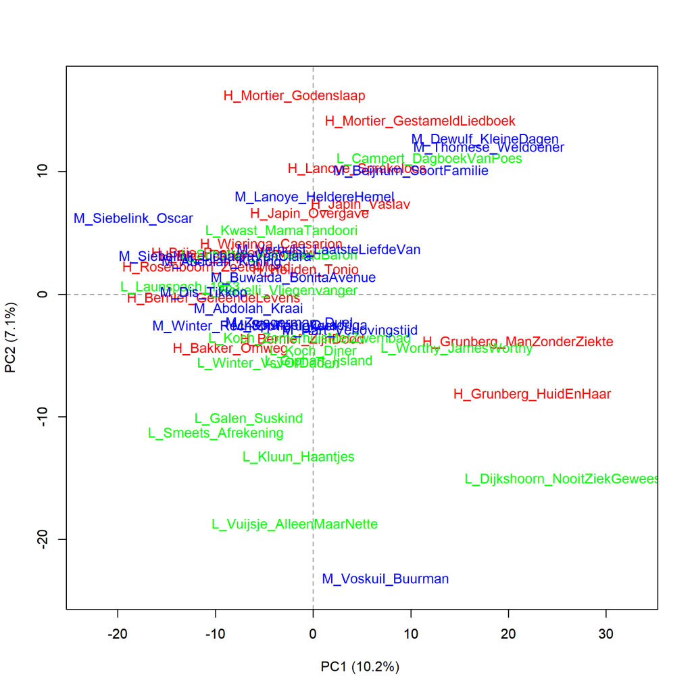
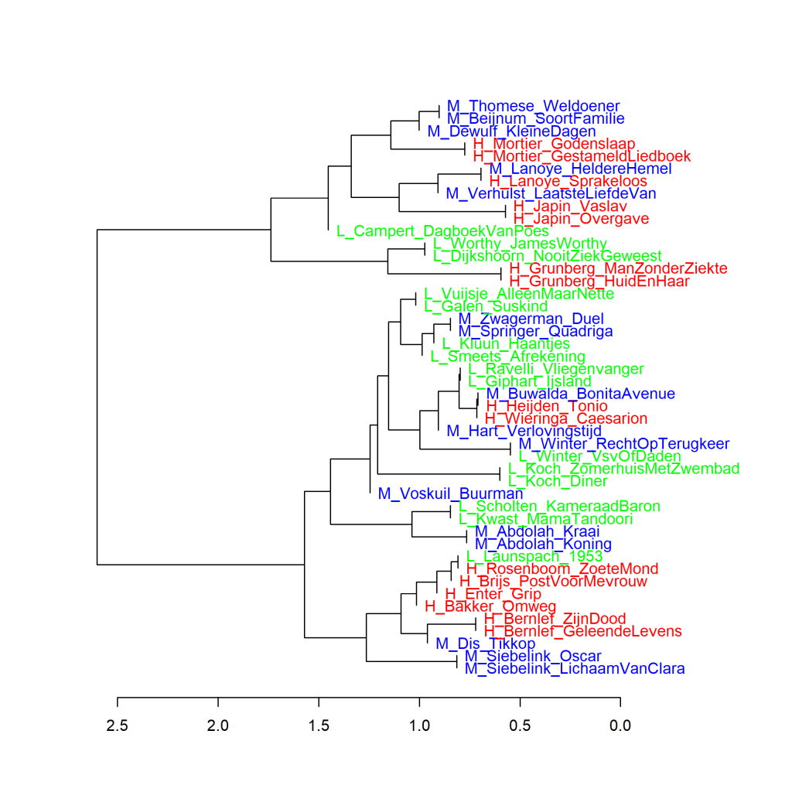
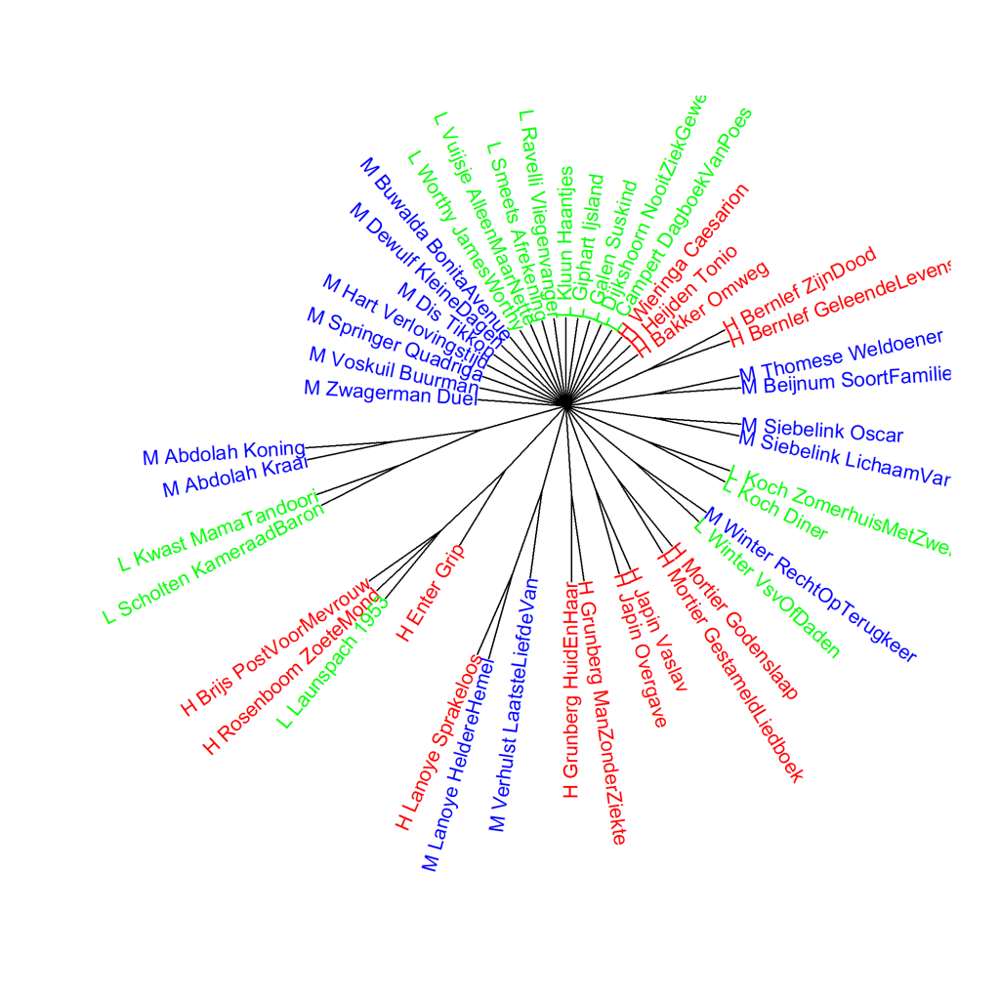

Kleurenversie van de grafiek op p. 205 van *Het raadsel literatuur*.

Nederlandse literaire romans van mannelijke auteurs, analyse op hoofdcomponenten (1000 meest frequente woorden).
Scores voor literaire kwaliteit: H (hoog), L (laag), en M (midden). Maat: PCA, correlatieversie.

### **Extra grafieken Nederlandse literaire romans van mannelijke auteurs**

Ook deze grafieken zijn gemaakt met het Stylo Package for R. Zie  Grafiek 4.5 voor meer informatie over het package en de verschillende maten.

**Grafiek 8.6.1 Nederlandse literaire romans van mannelijke auteurs**

Clusteranalyse (**1000** meest frequente woorden). Maat: Classic Delta.

Ook in de visualisatie van deze clusteranalyse is duidelijk te zien dat boeken van dezelfde auteur meestal het meest op elkaar lijken. Verder zijn er geen aparte takken voor romans die de hoogste of de laagste scores kregen voor literaire kwaliteit of die tot de middengroep behoorden.

**Grafiek 8.6.2 Nederlandse literaire romans van mannelijke auteurs**

Bootstrap consensus tree (**100** - **1000** meest frequente woorden, increment van 100, consensus strength 0.5). Maat: Classic Delta.

**Conclusie**

De extra metingen bevestigen het beeld dat er in de woordfrequenties van de Nederlandse literaire romans van mannelijke auteurs geen duidelijk verschil te vinden is tussen de romans die de hoogste of de laagste scores kregen voor literaire kwaliteit of die tot de middengroep behoorden. Meer hierover in *Het raadsel literatuur* op p. 204 en verder.

<!-- **Hoe zijn de metingen te repliceren?**
VOORBEELDQUERY HIER! -->
