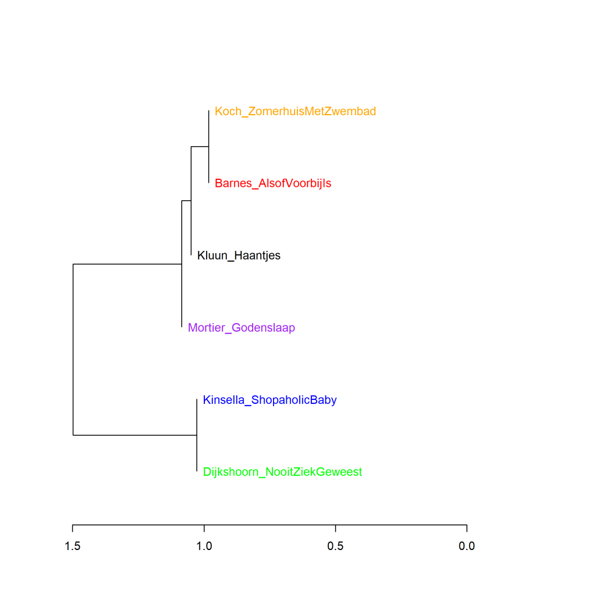
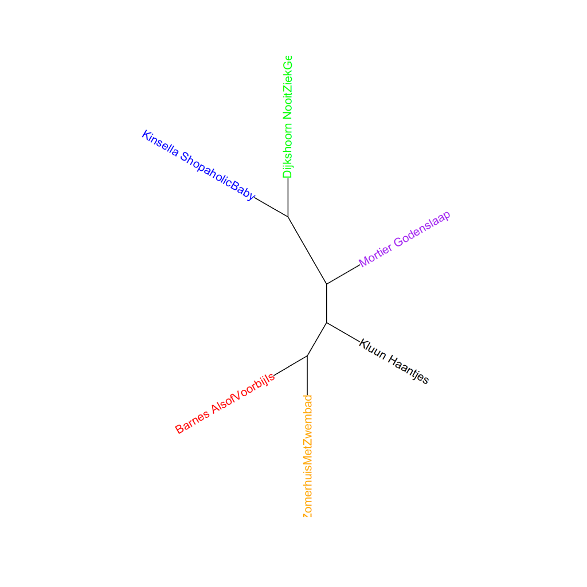
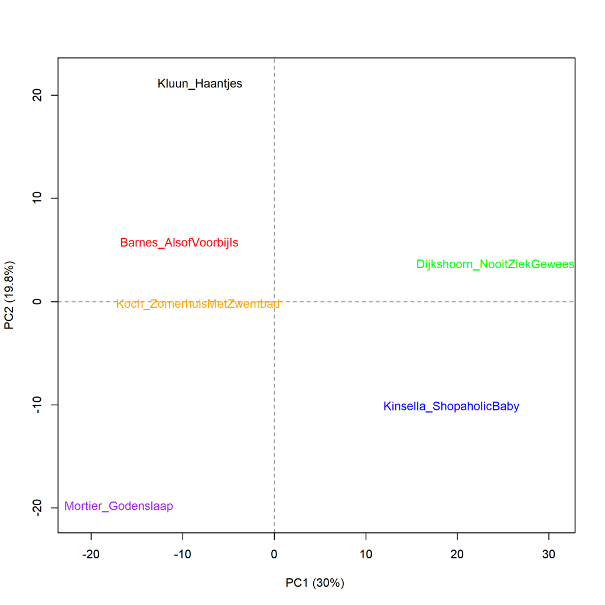

Kleurenversie van de grafiek op p. 225 van *Het raadsel literatuur*.

Kluun, *Haantjes*, versus Koch, *Zomerhuis met zwembad*, aangevuld met Barnes, *Alsof het voorbij is*, Kinsella, *Shopaholic en baby*, Dijkshoorn, *Nooit ziek geweest* en Mortier, *Godenslaap*, clusteranalyse (1000 meest frequente woorden). Maat: Classic Delta.

### **Extra grafieken Kluun versus Koch**

Ook deze grafieken zijn gemaakt met het Stylo Package for R. Zie  Grafiek 4.5 voor meer informatie over het package en de verschillende maten.

In Grafiek 8.7 werd bekeken of Voskuils *De buurman*  meer lijkt op een de meest literair gevonden romans uit het onderzoekscorpus of juist meer op een paar van de romans die het minst werden gewaardeerd om hun literaire kwaliteit. Hetzelfde doen we in Grafiek 8.10 voor de twee romans van Kluun (*Haantjes*) en Herman Koch (*Zomerhuis met zwembad*) die begin 2011 gelijktijdig verschenen en in de media voortdurend tegen elkaar werden afgezet. Ze worden vergeleken met dezelfde andere romans: uit de literaire top Barnes, *Alsof het voorbij is* en Mortier, *Godenslaap*, en van onder op de lijst Dijkshoorn, *Nooit ziek geweest* en Kinsella, *Shopaholic en baby*.

De clusteranalyse gevisualiseerd in Grafiek 8.10 is weer gebaseerd op de 1000 meest frequente woorden. De romans van Kluun en Koch zien we hier allebei terug in een cluster met Barnes en Mortier, terwijl de minst literaire boeken van Kinsella en Dijkshoorn samen het andere hoofdcluster vormen. Bij een reeks van clusteranalyses, gevisualiseerd in Grafiek 8.10.1,  zien we geen veranderingen in het beeld. Een analyse op hoofdcomponenten van deze zes romans geeft geen nieuwe inzichten maar bevestigt het beeld, zie Grafiek 8.10.2.

**Grafiek 8.10.1 Kluun, *Haantjes*, versus Koch, *Zomerhuis met zwembad*. Aangevuld met Barnes, *Alsof het voorbij is*, Kinsella, *Shopaholic en baby*, Dijkshoorn, *Nooit ziek geweest* en Mortier, *Godenslaap*.**

Bootstrap consensus tree (**100** - **1000** meest frequente woorden, increment van 100, consensus strength 0.5). Maat: Classic Delta.

**Grafiek 8.10.2 Kluun, *Haantjes*, versus Koch, *Zomerhuis met zwembad*. Aangevuld met Barnes, *Alsof het voorbij is*, Kinsella, *Shopaholic en baby*, Dijkshoorn, *Nooit ziek geweest* en Mortier, *Godenslaap*.**

Analyse op hoofdcomponenten (**1000** meest frequente woorden). Maat: PCA, correlatieversie.

**Conclusie**

De duellerende romans van Kluun en Koch sluiten beide eerder aan bij de meest literaire romans uit het corpus dan bij de op literaire kwaliteit weinig gewaardeerde boeken als we naar de woordfrequenties kijken. Ze lijken dus meer op elkaar dan in alle discussies over hun duel wordt gesuggereerd. Maar dat levert nog steeds weinig informatie op over wat het ene boek meer literaire waardering bezorgt dan het andere boek. Daarvoor moeten we dus verder kijken dan naar woordfrequenties alleen. Meer hierover in *Het raadsel literatuur* op p. 214-225.

<!-- **Hoe zijn de metingen te repliceren?**
VOORBEELDQUERY HIER! -->
