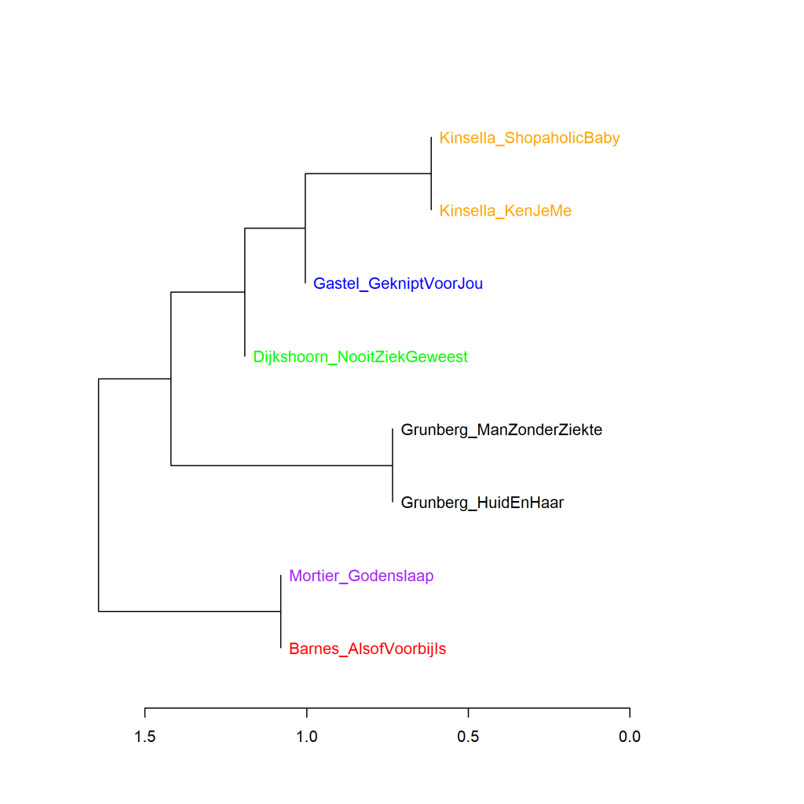
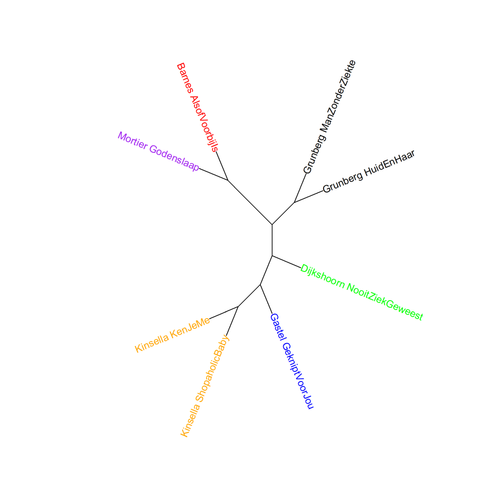
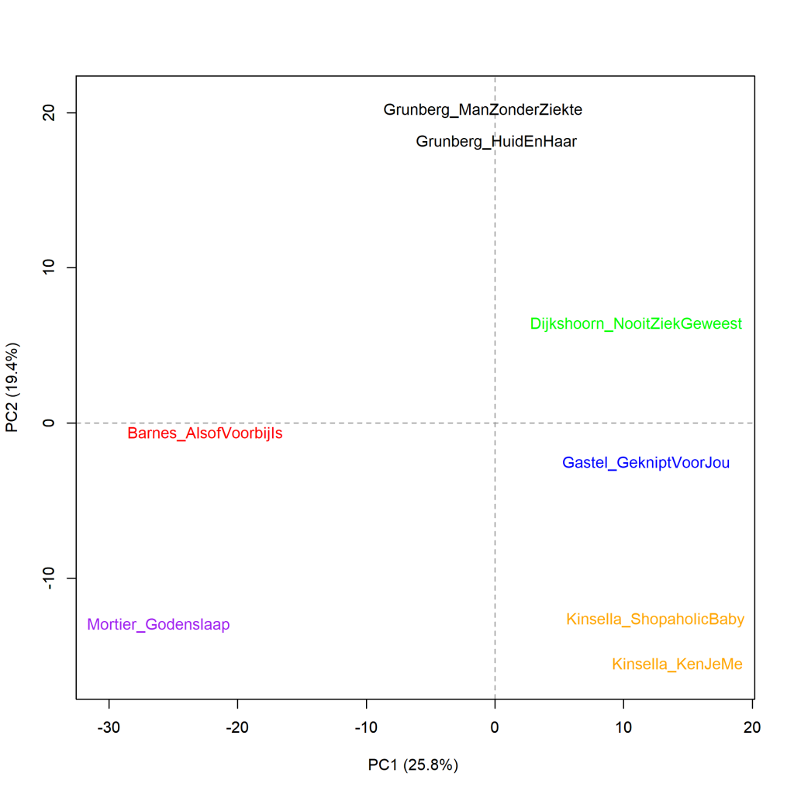

Kleurenversie van de grafiek op p. 233 van *Het raadsel literatuur*.

Grunberg, *Huid en haar* en *De man zonder ziekte*, versus Kinsella, *Shopaholic en baby* en *Ken je me nog?*.
Aangevuld met Van Gastel, *Geknipt voor jou!*, Dijkshoorn, *Nooit ziek geweest*, Barnes, *Alsof het voorbij is* en Mortier, *Godenslaap*, clusteranalyse (1000 meest frequente woorden). Maat: Classic Delta.

### **Extra grafieken Grunberg en de *Shopaholic*-test**

Ook deze grafieken zijn gemaakt met het Stylo Package for R. Zie  Grafiek 4.5 voor meer informatie over het package en de verschillende maten.

Op p. 73-74 van *Het raadsel literatuur* wordt beschreven hoe de twee romans van Arnon Grunberg in eerste metingen op basis van de woordfrequenties opduiken in clusters waarin chicklits overheersen. Reden om de *Shopaholic*-test zoals die in de grafieken 8.7 en 8.10 al is gedaan ook toe te passen op het werk van Grunberg.

De clusteranalyse gevisualiseerd in Grafiek 8.11 is gedaan op basis van de 1000 meest frequente woorden. De romans van Grunberg clusteren inderdaad bij de geselecteerde chicklits, die weinig literaire waardering kregen van de lezers, terwijl de wel hogelijk gewaardeerde literaire romans van Barnes en Mortier samen een eigen cluster vormen tegenover de andere geselecteerde romans. Hetzelfde beeld zien we als we een hele reeks van clusteranalyses maken, gevisualiseerd in Grafiek 8.11.1. Ook hier bevestigt een analyse op hoofdcomponenten (Grafiek 8.11.2) het globale beeld, maar geeft deze geen nieuwe inzichten. Het blijft onduidelijk waarom de literaire Grunberg nauwer aasluit bij de weinig literair gevonden chicklits; opnieuw is meer onderzoek nodig dan dat naar woorden alleen (en een verslag van dat onderzoek staat beschreven in Hoofdstuk 10 van *Het raadsel literatuur*).

**Grafiek 8.11.1 Grunberg, *Huid en haar* en *De man zonder ziekte*, versus Kinsella, *Shopaholic en baby* en *Ken je me nog?*. Aangevuld met Van Gastel, *Geknipt voor jou!*, Dijkshoorn, *Nooit ziek geweest*, Barnes, *Alsof het voorbij is* en Mortier, *Godenslaap*..**

Bootstrap consensus tree (**100** - **1000** meest frequente woorden, increment van 100, consensus strength 0.5). Maat: Classic Delta.

**Grafiek 8.11.2 Grunberg, *Huid en haar* en *De man zonder ziekte*, versus Kinsella, *Shopaholic en baby* en *Ken je me nog?*. Aangevuld met Van Gastel, *Geknipt voor jou!*, Dijkshoorn, *Nooit ziek geweest*, Barnes, *Alsof het voorbij is* en Mortier, *Godenslaap*.**

Analyse op hoofdcomponenten (**1000** meest frequente woorden). Maat: PCA, correlatieversie.

**Conclusie**

De duellerende romans van Kluun en Koch sluiten beide eerder aan bij de meest literaire romans uit het corpus dan bij de op literaire kwaliteit weinig gewaardeerde boeken als we naar de woordfrequenties kijken. Ze lijken dus meer op elkaar dan in alle discussies over hun duel wordt gesuggereerd. Maar dat levert nog steeds weinig informatie op over wat het ene boek meer literaire waardering bezorgt dan het andere boek. Daarvoor moeten we dus verder kijken dan naar woordfrequenties alleen. Meer hierover in *Het raadsel literatuur* op p. 225-233.

<!-- **Hoe zijn de metingen te repliceren?**
VOORBEELDQUERY HIER! -->
