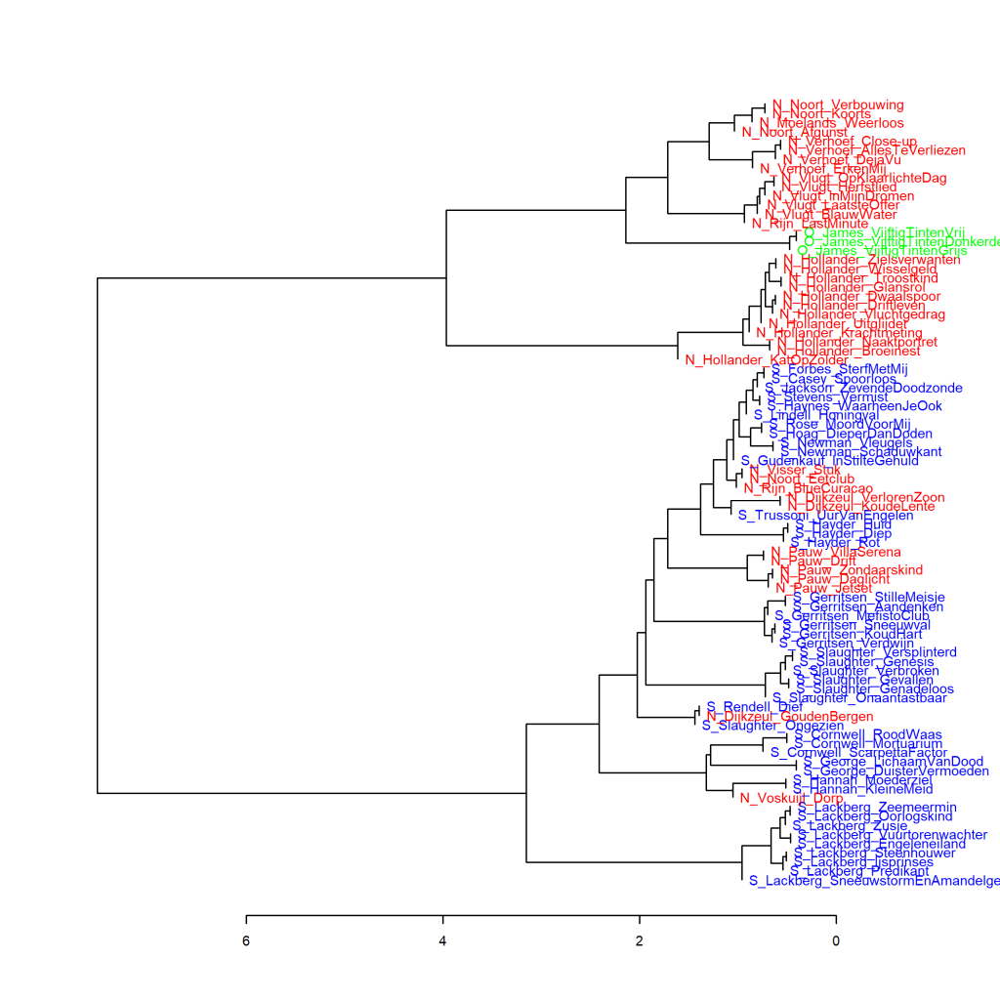

Kleurenversie van de grafiek op p. 246 van *Het raadsel literatuur*.

Vijftig tinten en Romantiek, analyse op hoofdcomponenten (1000 meest frequente woorden). Uit het Engels vertaalde romans staan weergegeven met een E_ voor de auteur en verkorte titel, en oorspronkelijk Nederlandstalige romans zijn aangeduid met N_. De O_ voor de Vijftig tinten-trilogie staat voor Overig. Maat: PCA, correlatieversie.

### **Extra grafieken Vijftig tinten en Spanning geschreven door vrouwen**

Ook deze grafieken zijn gemaakt met het Stylo Package for R. Zie  Grafiek 4.5 voor meer informatie over het package en de verschillende maten.

In Grafiek 9.3 verschijnt de Vijftig tinten-trilogie heel dicht bij twee spannende romans van Saskia Noort. Het is extra opvallend dat de trilogie bij Nederlandse romans in de buurt komt en niet bij de Engelse spannende boeken van vrouwen in het onderzoekscorpus. De clusteranalyse die is gevisualiseerd in Grafiek 9.3.1 geeft een iets andere blik: Noort is nog wel in de buurt, maar ook een aantal andere vrouwelijke auteurs van Nederlandse thrillers, en de afstand tot dat Nederlandse cluster is net als in Grafiek 9.2.1 de afstand tot de boeken uit de categorie Romantiek Delta-score 2. In de serie clusteranalyses die in Grafiek 9.3.2 wordt gevisualiseerd, verandert dat beeld niet. Het is lastig na te gaan waarom in de analyse op hoofdcomponenten Noort het dichtste bij de trilogie staat.

**Grafiek 9.3.1 Vijftig tinten en Spanning geschreven door vrouwen**

Clusteranalyse (**1000** meest frequente woorden). Maat: Classic Delta.

**Grafiek 9.3.2 Vijftig tinten en Spanning geschreven door vrouwen**

Bootstrap consensus tree (**100** - **1000** meest frequente woorden, increment van 100, consensus strength 0.5). Maat: Classic Delta.

**Conclusie**

De extra metingen nuanceren het beeld dat de *Vijftig tinten*-trilogie wat woordfrequenties betreft deels overlapt met de spannende boeken van vrouwelijke auteurs. Net als bij Grafiek 9.2 is de afstand tot een subgroepje vergelijkbaar met de afstand tussen de twee romans van Renate Dorrestein die in verschillende clusters voorkwamen in Grafiek 7.7. Meer in *Het raadsel literatuur* op p. 245-247. Wat fascinerend blijft is dat de trilogie aanzienlijk dichter aanschuift bij Nederlandse dan bij vertaalde romans. We weten niet wie de vertalers van de trilogie zijn - komen sommige van hen (dat het een team was is wel bekend) wellicht ook zelf voor als auteur in de geanalyseerde spannende romans?

<!-- **Hoe zijn de metingen te repliceren?**
VOORBEELDQUERY HIER! -->
