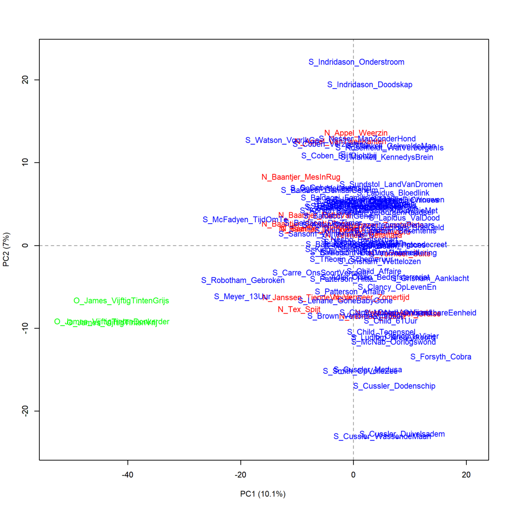
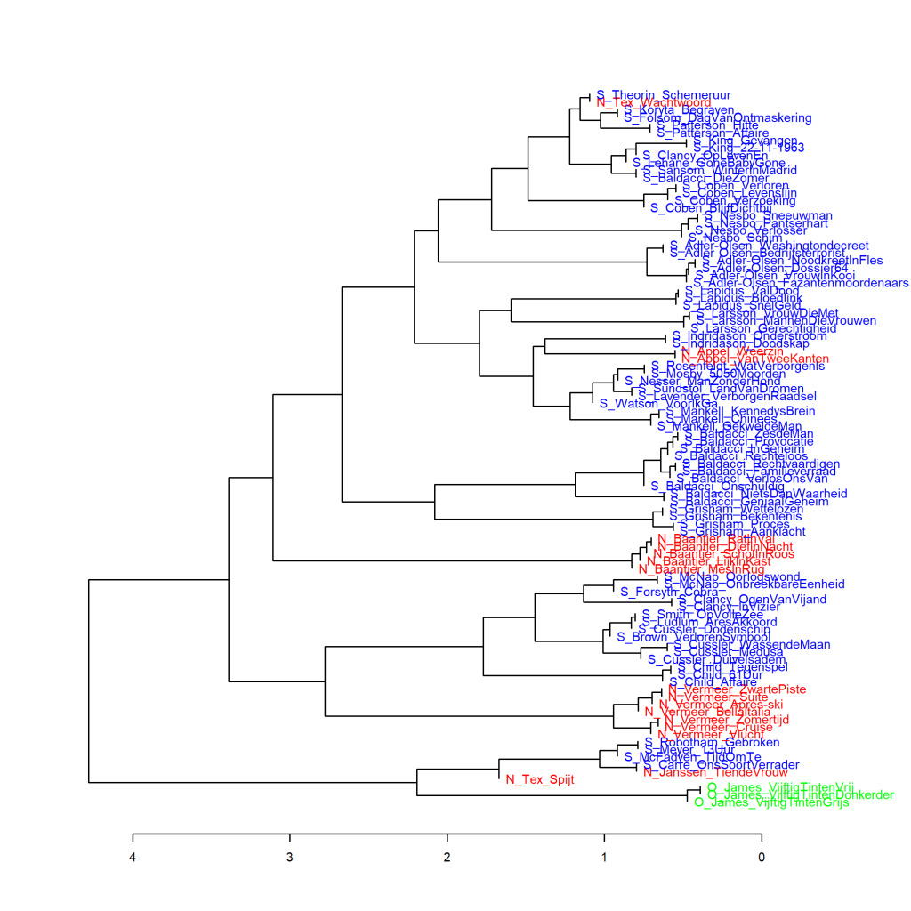
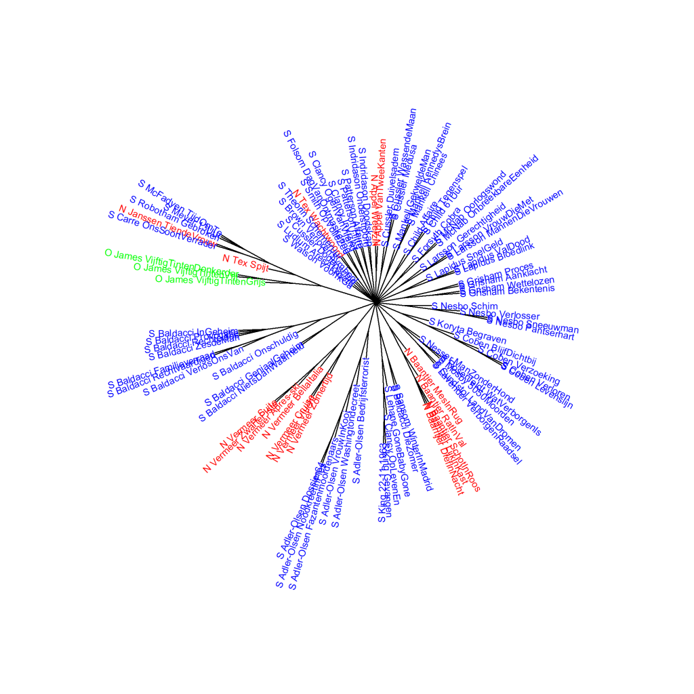

Extra grafieken bij p. 245 van *Het raadsel literatuur*.

Ook deze grafieken zijn gemaakt met het Stylo Package for R. Zie  Grafiek 4.5 voor meer informatie over het package en de verschillende maten.

In *Het raadsel literatuur* zijn twee grafieken afgedrukt waarin de *Vijftig tinten*-trilogie van E.L. James wordt vergeleken met andere romans om uit te vinden op welk genre de boeken het meeste lijken in woordfrequenties; in Grafiek 9.2 met Romantiek en in Grafiek 9.3 met Spanning van de hand van vrouwelijke auteurs. In Grafiek 9.3 zijn alleen de spannende boeken van vrouwen opgenomen omdat de visualisatie anders niet meer leesbaar zou zijn. Hier presenteer ik ook de grafieken waarin de trilogie wordt vergeleken met Spanning geschreven door mannelijke auteurs. Een vergelijking met de Literaire romans uit het onderzoekscorpus staat in een volgende webpagina.

**Grafiek 9.3.3 Vijftig tinten en Spanning geschreven door mannen**

Uit het Engels vertaalde romans staan weergegeven met een E_ voor de auteur en verkorte titel, en oorspronkelijk Nederlandstalige romans zijn aangeduid met N_. De O_ voor de Vijftig tinten-trilogie staat voor Overig. Maat: PCA, correlatieversie.

**Grafiek 9.3.4 Vijftig tinten en Spanning geschreven door mannen**

Clusteranalyse (**1000** meest frequente woorden). Maat: Classic Delta.

**Grafiek 9.3.5 Vijftig tinten en Spanning geschreven door mannen**

Bootstrap consensus tree (**100** - **1000** meest frequente woorden, increment van 100, consensus strength 0.5). Maat: Classic Delta.

**Conclusie**

De *Vijftig tinten*-trilogie staat verder af van de spannende boeken uit het onderzoekscorpus die zijn geschreven door mannelijke auteurs dan van die van de hand van vrouwelijke auteurs (zie bijvoorbeeld de Delta score in Grafiek 9.3.4 onder de grafiek ter hoogte van de plaats waar de trilogie samenclustert met een zestal spannende boeken). Wat verder opvalt in deze extra grafieken is dat de Nederlandse en vertaalde spannende boeken goed gemengd voorkomen, terwijl er in de analyses van de spannende boeken van vrouwen in Grafiek 9.3 een veel groter verschil lijkt te zijn tussen Nederlandseen vertaalde titels. Meer hierover in *Het raadsel literatuur* op p. 245-247.

<!-- **Hoe zijn de metingen te repliceren?**
VOORBEELDQUERY HIER! -->
