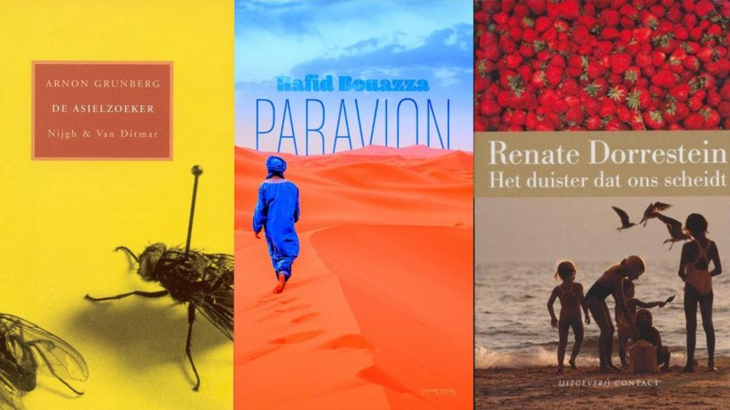

**Karina van Dalen-Oskam** *20 November 2021*

Arnon Grunberg is een van de auteurs die prominent in *Het raadsel literatuur* voorkomen. Bij het doormeten van de boeken uit het onderzoekscorpus bleken zijn romans *Huid en haar* en *De man zonder ziekte* steeds het meest te lijken op literair weinig gewaardeerde chicklits van Sophie Kinsella en anderen. De omvang van zijn woordenschat, de gemiddelde lengte van zijn zinnen en de aandacht voor menselijke relaties is vergelijkbaar met die in de chicklits in het corpus. Toch is er niemand die zijn boeken tot dat genre zou rekenen; het label Literair roman zal niemand betwisten. In zijn bespreking van *Het raadsel literatuur* in [Neerlandistiek.nl](https://neerlandistiek.nl/2021/11/schrijft-arnon-grunberg-chicklit/) vat Marc van Oostendorp samen: ‘De reden is, mogelijk, dat het inhoudelijk helemaal geen chicklit is, al is het maar omdat bij Grunberg niets ooit goed afloopt. Misschien is het zelfs wel de spanning tussen de betrekkelijk eenvoudige stijl en de ingewikkelde inhoud die het goed doet.’ En hij vervolgt, tussen ronde haken: ‘Een beetje vreemd is wel dat het proefschrift van Suzanne Fagel, die óók onderzoek deed met de computer naar de stijl van Grunberg, niet genoemd wordt.’ Dat is een terechte opmerking. Daarom is dit eerste blog bij mijn boek gewijd aan het onderzoek van Fagel en licht ik toe hoe haar methode zich verhoudt tot de methoden die ik heb toegepast in *Het raadsel literatuur*.

In haar proefschrift *De stijl van gewoon proza* (2015) presenteert Suzanne Fagel haar onderzoek naar stijl in modern Nederlands literair proza. In haar onderzoek verbindt zij romaninterpretatie met taalkundige analyse – iets wat in de Angelsaksische academische wereld bekend staat als *literary linguistics* of *stylistics* maar in het Nederlandse taalgebied vrijwel niet wordt beoefend. Het laatste hoofdstuk van haar proefschrift is een case study gewijd aan de stijl van Arnon Grunberg. Recensenten wijzen regelmatig op aforismen, woordherhalingen, humor en ironie, cynisme, en beschrijven zijn stijl gewoonlijk als helder en onopgesmukt. Fagel wil onderzoeken hoe Grunbergs thematiek zich verhoudt tot die aforistische, sobere stijl. Haar kernvraag is:

> ‘Draagt ook Grunbergs stijl bij tot de uitdrukking van het thema van zijn werk? Kunnen oordelen van recensenten herleid worden tot tekstuele eigenschappen? En kan de relatie tussen stijl en thematiek ook kwantitatief worden vastgesteld?’ (Fagel 2015, p. 184).

Fagel onderzoekt dat in de roman *De asielzoeker* (2003), die ze voor een aantal taalkundige eigenschappen vergelijkt met twee andere romans die in hetzelfde jaar verschenen: *Het duister dat ons scheidt* van Renate Dorrestein en *Paravion* van Hafid Bouazza. Ze begint met een analyse van de inhoud van Grunbergs roman. Haar vallen twee dingen op. Ten eerste het afstandelijke, registrerende karakter van hoofdpersoon Christian Beck, die zich voordoet als een buitenstaander. Ten tweede de stilstand van Beck, die wel observeert, maar niet aan het leven en de maatschappij deelneemt. Fagel wil onderzoeken hoe die twee aspecten zijn terug te vinden in de taal van de roman. Recensenten hebben opgemerkt, zoals Fagel het samenvat, ‘dat Beck zijn leven heeft ommuurd met stellingen en algemene levenswijsheden. Deze drie stijlkenmerken, definities, vergelijkingen/metaforen en herhalingen, komen vaak in elkaars nabijheid voor’ (p. 196).  Ter illustratie geef ik hier een van de citaten uit *De asielzoeker* die Fagel hierbij gebruikt:

> ‘Zoals zijn vrouw vond dat geld iets was om weg te geven, net als kleren, zo vond Beck dat geld iets was om op te maken. Het kwam op hetzelfde neer. Weggeven is een vorm van opmaken.’ (*De asielzoeker*, p. 243)

In zulke zinnen komt geen enkel gevoel van twijfel of onzekerheid voor, wat uitgedrukt had kunnen zijn door hulpwerkwoorden zoals ‘schijnen’ of ‘lijken’. Ook bijwoorden van modaliteit als ‘misschien’, ‘gelukkig’ en ‘wellicht’ ontbreken. Juist het woordje ‘is’ in Grunbergs definities en vergelijkingen maakt de uiting zo stellig en onderstreept de inhoud die hij in de roman presenteert. Verder wijst Fagel erop dat aforismen of definities als ‘Weggeven is een vorm van opmaken’ *statische* uitspraken zijn: ‘Niemand doet iets of handelt, het enige dat gebeurt is dat er een eigenschap aan een persoon wordt toegeschreven. Terwijl dat gebeurt, staat het verhaal stil.’ (Fagel 2015, p. 197) Zo’n definitie staat bovendien bijna altijd in de tegenwoordige tijd.

Voor de twee genoemde aspecten, ‘afstandelijkheid’ en ‘stilstand’, wil Fagel nog meer in detail onderzoeken hoe ze zijn terug te zien in de schrijfstijl van de roman. Ze kijkt daarvoor niet naar de complete roman en naar alle taalkenmerken, maar selecteert een aantal aspecten waarvan ze verwacht dat ze met deze concepten te maken zouden kunnen hebben: werkwoordstijden, zinsaspect, werkwoordstypen en connectiefgebruik. Ik ga hier ter illustratie van haar methode alleen wat verder in op haar aanpak van de werkwoordstypen. Daarna leg ik uit hoe mijn eigen methoden zich tot die van Fagel verhouden.

Om het idee van een grotere ‘stilstand’ in *De asielzoeker* taalkundig te onderzoeken, gaat Fagel na wat het aandeel is van drie soorten werkwoorden: werkwoorden die een handeling (actie) beschrijven, werkwoorden die een toestand aanduiden en werkwoorden die mentale processen (cognitie) omschrijven. Ze selecteert hiervoor de eerste vijftig zinnen uit de roman en vult die aan met een passage van vijftig zinnen uit het midden van het boek. Hetzelfde doet zij voor de geselecteerde romans van Dorrestein en Bouazza. Haar verwachting – haar hypothese – is dat van deze drie romans *De asielzoeker* de minste actiewerkwoorden bevat en dat er naar verhouding meer toestands- en cognitiewerkwoorden in voorkomen.

Uit het telwerk blijkt inderdaad dat *De asielzoeker* relatief veel cognitiewerkwoorden en relatief weinig actiewerkwoorden bevat. Ook heeft het boek relatief veel toestandsaanduidende werkwoorden. Deze twee observaties bevestigen Fagels hypothese. Er is echter ook een onverwacht resultaat. Fagel maakte bij het bestuderen van de verschillende soorten cognitiewerkwoorden onderscheid tussen werkwoorden van perceptie en andere werkwoorden en haar verwachting was dat *De asielzoeker*  relatief veel werkwoorden van perceptie zou bevatten, omdat het personage Beck een buitenstaanderspositie inneemt en observerend aan de zijlijn van het leven staat zonder er nog aan deel te nemen. Dat doet verwachten dat werkwoorden van perceptie zoals ‘zien’ en ‘kijken’ en dergelijke nadrukkelijker aanwezig zijn dan werkwoorden uit de andere subcategorieën van de cognitiewerkwoorden die betrekking hebben op kennis, emotie, wens, intentie en besluit. En dat blijkt niet het geval. Wat wel opvalt in *De asielzoeker* is het grote aantal werkwoorden uit de categorie kennis. Fagel bekijkt de roman daardoor met een nieuwe blik:

> ‘Becks redeneerprocessen gaan vaak over kennis die hij heeft opgedaan en besluiten die hij heeft genomen: “Beck weet dat..., daarom heeft hij besloten dat...” is een typerende *Asielzoeker*constructie. Opvallend is dat het daarbij gaat om rationele besluitvorming: weten en besluiten; typische gevoelszaken als emoties en wensen komen weinig voor in *De asielzoeker*. Dit is in overeenstemming met het beeld van Beck als iemand die zijn eigen emoties heeft afgezworen en volgens een zelfbedacht, rationeel systeem wil leven. De omvang van de uitgevoerde analyse staat echter niet toe om hier duidelijke uitspraken te doen: emoties en wensen komen in *Duister* en *Paravion* evenmin vaak voor.’ (Fagel 2015, p. 219-220)

Dat kan liggen aan het categoriseringssysteem, meent Fagel. Dat zou ons onvoldoende in staat kunnen stellen om de verhouding tussen emoties en rationele beslissingen te meten. Maar het kan ook komen, zo legt zij uit, door de geringe omvang van de steekproef, die zoals al vermeld in totaal honderd zinnen per roman besloeg. En die opmerking leidt tot het grote verschil tussen de methode die Fagel heeft gekozen  en de methoden die ik hanteer in *Het raadsel literatuur*.

In mijn onderzoek naar wat de taal van een roman moet hebben om door lezers meer of minder literair gevonden te worden, heb ik voor methoden gekozen die bestaan uit relatief eenvoudige metingen van een relatief grote verzameling teksten die met hulp van software kunnen worden uitgevoerd. Het gaat vaak om de (relatieve) frequenties van de meest gebruikte woorden in een corpus van 401 romans. In de vakliteratuur wordt deze benadering wel omschreven als ‘distant reading’, lezen van op een afstand. We krijgen een idee over de globale verhoudingen tussen een groot aantal teksten, zonder dat we precies kunnen zien waar de overeenkomsten en verschillen precies in zitten. Maar het geeft ons een idee in welke richting we nader onderzoek kunnen gaan doen om helderder te krijgen welke taalkundige eigenschappen nu precies bijdragen aan het globale beeld.

Fagel gaat omgekeerd te werk: op basis van haar lezing van de roman selecteert zij een kleine set specifieke taalkundige kenmerken waarvan zij verwacht dat ze met haar observaties kunnen samenhangen. Vervolgens stelt zij handmatig vast welke daarvan inderdaad een rol spelen. Ze benadrukt dat er nog heel veel andere aspecten een rol kunnen spelen en dat nader onderzoek gewenst is om de observaties in de hele tekst of in andere teksten te bevestigen. Waar ik veel materiaal van een afstand bekijk en vervolgens inzoom naar meer detail, bekijkt Fagel 1 roman van Grunberg van dichtbij en stelt vast op welke manier er vervolgens uitgezoomd kan gaan worden.

Van een afstand of van dichtbij: beide benaderingen leiden tot meer inzicht in hoe de stijl van een auteur als Grunberg zich verhoudt tot die van andere auteurs. Beide leiden ook tot nieuwe vragen. Zowel Fagel als ik zijn ervan overtuigd dat de twee benaderingen gecombineerd moeten worden. Wat mijn analyse heeft opgeleverd is dat de stijl van literaire romans als die van Grunberg niet los gezien kan worden van die in romans uit andere genres. Fagels onderzoek levert aanknopingspunten voor grootschaliger onderzoek ‘van een afstand’, met inzet van software die bijvoorbeeld automatisch vaststelt tot welk typen de werkwoorden behoren. Daarna zou dan kunnen worden nagegaan hoe die typen zich tot elkaar verhouden in heel veel andere romans. Er moet nog heel veel werk worden verzet voor zo’n ontmoeting tussen ver en dichtbij: een uitdagende hoeveelheid stof voor nog meer proefschriften, wetenschappelijke artikelen en scripties.

Suzanne Fagel-De Werd. *De stijl van gewoon proza*. Proefschrift Leiden 2015. [Digitaal beschikbaar](https://scholarlypublications.universiteitleiden.nl/handle/1887/31606).
