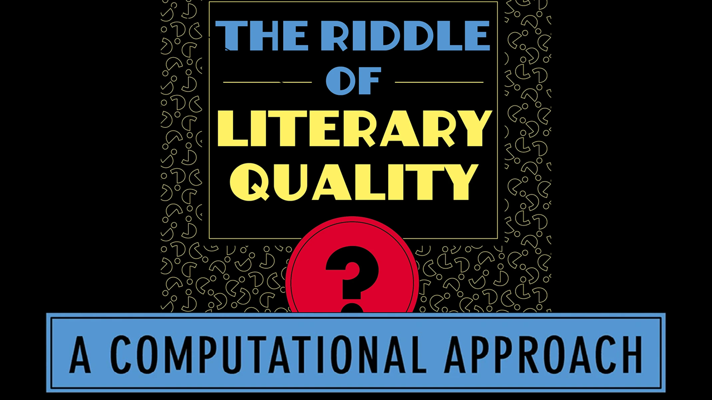

---
# Feel free to add content and custom Front Matter to this file.
# To modify the layout, see https://jekyllrb.com/docs/themes/#overriding-theme-defaults

home: "true"
---

[NEWS](02_03_news.html) | [REVIEWS](02_06_reviews.html) | [DATA AND R PACKAGE](02_07_data_and_the_R_package.html)

This website presents additional information to the monograph *The Riddle of Literary Quality: A Computational Approach* by Karina van Dalen-Oskam, published on 26 June 2023 by [Amsterdam University Press](https://www.aup.nl/en/book/9789048558148/the-riddle-of-literary-quality) and available in open access through [OAPEN](https://library.oapen.org/handle/20.500.12657/63705).

The ">"" in the red circle on the left top of the page leads to the overview of colour versions of the graphs published in the book, with additional graphs and information. Many of the graphs have interactive features. The tab "News" contains general information about the monograph and "Reviews" presents an overview of reviews of the book and other kinds of responses. "Data and R Package" list information about the litRiddle R package that contains all data that may be shared and which can be used to replicate and verify the research presented in the book. It also provides a link to cvs files of the data tables.

The site is developed by Joris van Zundert. It contains contributions by Karina van Dalen-Oskam, Joris van Zundert, Maciej Eder, and Saskia Lensink. For remarks, mail [Karina van Dalen-Oskam](https://www.huygens.knaw.nl/en/medewerkers/karina-van-dalen-oskam-2/).

*Last updated 5 July 2023*.
